# **I, Tổng quan về quy trình làm việc và phân tích trường hợp**
#### 1. Tổng quan về quy trình làm việc
Trước khi bắt đầu phân tích Autopsy và dữ liệu, bạn cần thực hiện một số bước; chẳng hạn như xác định nguồn dữ liệu và các hành động Autopsy cần thực hiện với nguồn dữ liệu đó.

Quy trình làm việc cơ bản:
* Tạo/mở trường hợp cho nguồn dữ liệu bạn sẽ điều tra
* Chọn nguồn dữ liệu bạn muốn phân tích
* Cấu hình các mô-đun thu thập để trích xuất các hiện vật cụ thể từ nguồn dữ liệu
* Xem lại các hiện vật được trích xuất bởi các mô-đun nhập
* Tạo báo cáo

#### 2. Phân tích trường hợp | Tạo trường hợp mới
Để bắt đầu một cuộc điều tra mới, bạn cần tạo tệp vụ án (case file) từ nguồn dữ liệu (data source).
Khi bạn mở Autopsy, sẽ có ba tùy chọn chính.
Bạn có thể tạo một vụ án mới bằng cách chọn “New Case”.

Khi nhấp vào “New Case”, menu Case Information sẽ mở ra, nơi bạn sẽ nhập thông tin liên quan đến vụ án.

Các trường thông tin trong Case Information:
* Case Name: Tên bạn muốn đặt cho vụ án.

* Base Directory: Thư mục gốc sẽ lưu toàn bộ các tệp liên quan đến vụ án (đường dẫn đầy đủ sẽ được hiển thị).

* Case Type: Xác định xem vụ án là

    * Local (Single-user) – dành cho một người dùng duy nhất, hoặc

    * Hosted (Multi-user) – được lưu trên máy chủ để nhiều nhà phân tích có thể cùng xem và xử lý.

Màn hình tiếp theo có tiêu đề “Optional Information” — phần này có thể để trống trong bài học này.
Tuy nhiên, trong một môi trường điều tra pháp y thực tế, bạn nên điền đầy đủ thông tin này.

Khi nhấp “Finish”, Autopsy sẽ tạo một tệp vụ án mới từ nguồn dữ liệu đã chọn.

#### 3. Phân tích vụ án | Mở một vụ án có sẵn (Case Analysis | Open an Existing Case)
Autopsy cũng có thể mở các tệp vụ án đã được tạo sẵn (prebuilt case files).
Các tệp vụ án của Autopsy có đuôi mở rộng **.aut**.

Cách mở vụ án có sẵn:

Chọn “Open Case” trong menu chính của Autopsy.

* Duyệt đến thư mục chứa vụ án (trong phòng thực hành này, thư mục nằm trên màn hình Desktop).

* Chọn tệp .aut mà bạn muốn mở.

* Autopsy sẽ xử lý các tệp vụ án và mở vụ án để bạn bắt đầu phân tích.

Sau khi mở, bạn có thể thấy tên của vụ án hiển thị ở góc trên bên trái cửa sổ Autopsy.

Lưu ý: Một hộp cảnh báo sẽ xuất hiện nếu Autopsy không thể định vị được ảnh đĩa. Lúc này, bạn có thể trỏ đến vị trí ảnh đĩa mà nó đang cố gắng tìm, hoặc bạn có thể nhấp vào NO; bạn vẫn có thể phân tích dữ liệu từ trường hợp Autopsy.

# **II, Data Sources**
Nguồn dữ liệu (Data Sources)

Autopsy có khả năng phân tích nhiều định dạng ảnh đĩa (disk image formats) khác nhau.
Trước khi đi sâu vào bước phân tích dữ liệu, hãy cùng điểm qua các loại nguồn dữ liệu mà Autopsy có thể xử lý.

Bạn có thể thêm nguồn dữ liệu bằng cách nhấp vào nút “Add Data Source”.
Các tùy chọn khả dụng sẽ được hiển thị trong giao diện, như hình minh họa bên dưới.

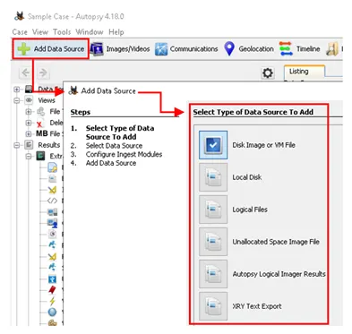

Các định dạng ảnh đĩa được Autopsy hỗ trợ (Supported Disk Image Formats):

* Raw Single: ví dụ: *.img, *.dd, *.raw, *.bin

* Raw Split: ví dụ: *.001, *.002, *.aa, *.ab, …

* EnCase: ví dụ: *.e01, *.e02, …

* Virtual Machines: ví dụ: *.vmdk, *.vhd

💡 Lưu ý:
Nếu bạn có nhiều tệp ảnh đĩa (ví dụ: E01, E02, E03, ...) Autopsy chỉ cần bạn chọn tệp đầu tiên (ví dụ: E01), và chương trình sẽ tự động nhận diện và xử lý các tệp còn lại.

# **III, Mô-đun Ingest (Ingest Modules)**

#### **🔍 Ingest Modules là gì?**

Ingest Modules thực chất là các phần mở rộng (plug-in) của Autopsy.
Mỗi mô-đun ingest được thiết kế để phân tích và trích xuất một loại dữ liệu cụ thể từ ổ đĩa.

Bạn có thể cấu hình Autopsy để chạy các mô-đun ingest:

* Trong lúc thêm nguồn dữ liệu (data source)
* Sau khi đã thêm nguồn, bằng cách chọn nguồn dữ liệu cần phân tích từ bảng điều khiển (dashboard).

Mặc định, Ingest Modules được thiết lập để chạy trên:
* Tất cả các tệp (All Files)
* Thư mục (Directories)
* Không gian chưa phân bổ (Unallocated Space)

Tuy nhiên, bạn có thể thay đổi phạm vi phân tích này trong bước chọn mô-đun.
Tiến trình thực thi sẽ được hiển thị bằng thanh trạng thái ở góc dưới bên phải của cửa sổ Autopsy.

Cấu hình các mô-đun thu thập dữ liệu trong khi thêm nguồn dữ liệu:

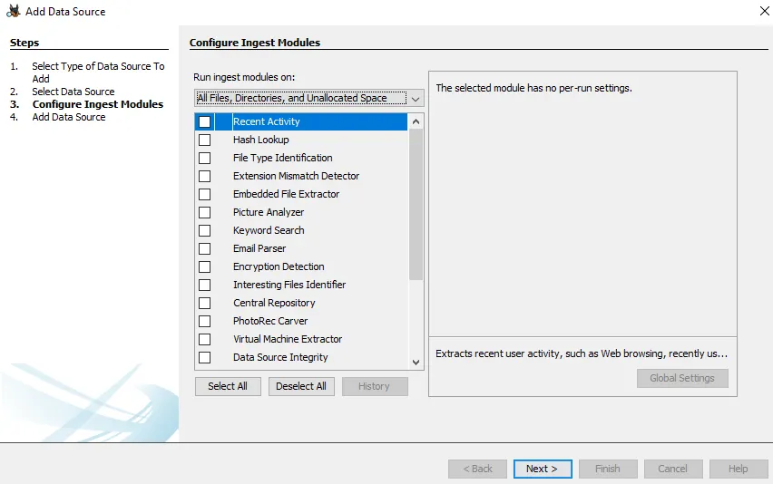

#### ⚙️ Hai cách sử dụng Ingest Modules
**1. Cấu hình mô-đun khi thêm nguồn dữ liệu (Add Data Source Stage)**

* Khi bạn thêm một data source mới, có thể chọn các mô-đun ingest để chạy ngay lập tức.

* Autopsy sẽ tự động phân tích và trích xuất dữ liệu dựa trên các mô-đun được chọn.

2. Sử dụng mô-đun sau khi đã thêm nguồn dữ liệu (After Adding Data Source)

* Nhấp chuột phải vào nguồn dữ liệu và chọn “Run Ingest Modules”.

* Chọn các mô-đun bạn muốn chạy rồi nhấn “Finish”.

* Theo dõi tiến trình chạy mô-đun ở góc dưới bên phải màn hình.

**🧩 Kết quả mô-đun (Results)**

Khi các mô-đun ingest hoàn thành, kết quả sẽ được hiển thị trong mục Results node (cột bên trái trong giao diện Autopsy).

Ví dụ:
Mô-đun “Interesting Files Identifier” sẽ tìm các tệp được cho là đáng chú ý.
Tuy nhiên, nếu dữ liệu tương ứng không tồn tại trong ổ đĩa, thì sẽ không có kết quả nào được hiển thị.

**⚠️ Lưu ý về thiết lập mô-đun (Per-run Settings)**

Trong cửa sổ Configure Ingest Modules, bạn sẽ thấy rằng:

* Một số mô-đun có thiết lập riêng cho mỗi lần chạy,

* Một số thì không có.

Ví dụ:

* Mô-đun Keyword Search → không có thiết lập riêng từng lần chạy.

* Mô-đun Interesting Files Finder → có thiết lập riêng.

* Mô-đun có biểu tượng tam giác vàng nghĩa là có tùy chọn per-run settings.

**📥 Hộp thư Ingest Inbox**

Khi các mô-đun ingest đang chạy, thông báo cảnh báo (alerts) có thể xuất hiện trong Ingest Inbox.
Dưới đây là ví dụ về Ingest Inbox sau khi một số mô-đun đã hoàn tất chạy.

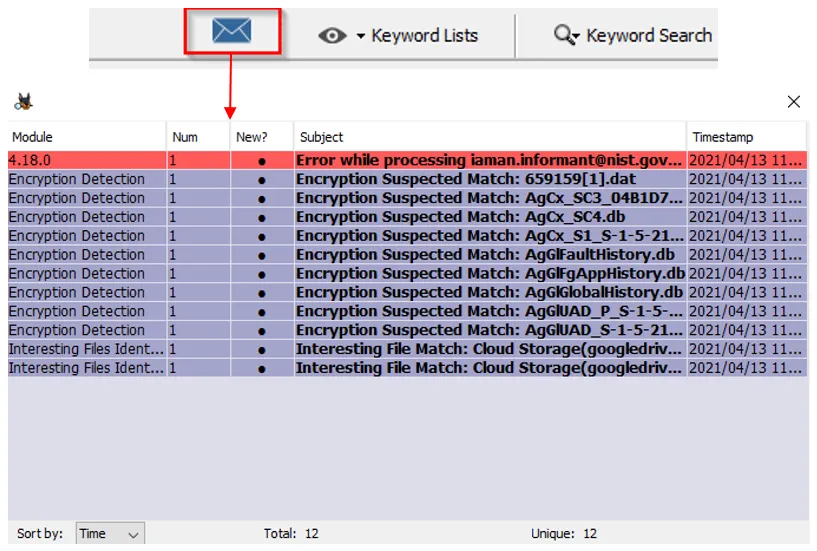

**🧠 Ghi nhớ:**
Autopsy chỉ thêm siêu dữ liệu (metadata) về các tệp vào cơ sở dữ liệu cục bộ,
không lưu toàn bộ nội dung tệp thực tế.

# **IV, Giao diện người dùng I(The User Interface I)**
Hãy cùng xem giao diện người dùng của Autopsy, bao gồm 5 khu vực chính:
#### **1. Tree Viewer**
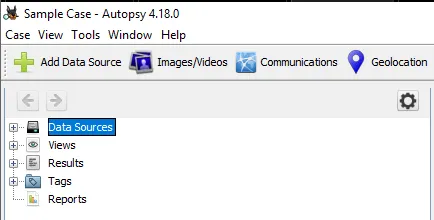
Trình xem cây (Tree Viewer) trong Autopsy có 5 nút chính (top-level nodes) :

**🌐 Data Sources (Nguồn dữ liệu)**

* Đây là nơi chứa toàn bộ dữ liệu được nhập vào.

* Các tệp và thư mục được sắp xếp giống như trong Windows File Explorer thông thường — giúp bạn dễ dàng duyệt nội dung ổ đĩa hoặc ảnh đĩa.

**🗂 Views (Chế độ xem)**

* Dữ liệu sẽ được phân loại dựa trên các tiêu chí khác nhau, ví dụ:

    * Loại tệp (File type)

    * Kiểu MIME (MIME type)

    * Kích thước tệp (File size)

    * Phần mở rộng, ngày tạo, ngày sửa đổi, v.v.

* Cách này giúp bạn nhanh chóng lọc và tìm tệp theo định dạng hoặc đặc điểm cụ thể.

**🧩 Results (Kết quả)**

* Đây là nơi hiển thị kết quả của các Ingest Modules (đã nói ở phần trước).

* Ví dụ: nếu bạn chạy mô-đun tìm kiếm tệp “Interesting Files Identifier”, kết quả sẽ được hiển thị tại đây.

**🏷 Tags (Thẻ đánh dấu)**

* Phần này hiển thị các tệp hoặc kết quả mà bạn hoặc Autopsy đã gắn thẻ (tag).

* Tagging giúp đánh dấu những dữ liệu quan trọng để xem lại hoặc đưa vào báo cáo.

**📑 Reports (Báo cáo)**

* Hiển thị các báo cáo được tạo —bởi các mô-đun Autopsy, hoặc
bởi người phân tích (analyst).

* Bạn có thể tạo báo cáo để tổng hợp kết quả phân tích, xuất ra file, hoặc chia sẻ với người khác.

#### **2. Result Viewer**
Khi một ổ đĩa, tệp, thư mục, v.v. được chọn từ Trình xem Cây, thông tin bổ sung về mục đã chọn sẽ được hiển thị trong Trình xem Kết quả. Ví dụ: nguồn dữ liệu của trường hợp Mẫu được chọn, và giờ đây thông tin bổ sung sẽ hiển thị trong Trình xem Kết quả.

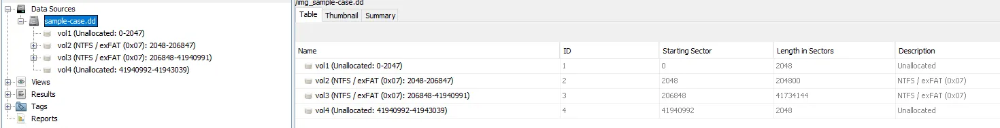

Nếu một ổ đĩa được chọn, thông tin của Trình xem kết quả sẽ thay đổi để phản ánh thông tin trong cơ sở dữ liệu cục bộ cho ổ đĩa đã chọn.

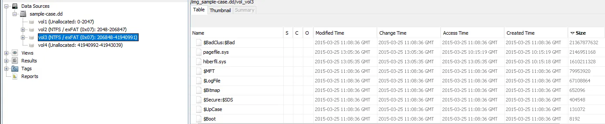

Lưu ý rằng ngăn Result Viewer có ba tab: Table , Thumbnail và Summary . Ảnh chụp màn hình ở trên phản ánh thông tin hiển thị trong tab Bảng. Tab Hình thu nhỏ(Thumbnail) hoạt động tốt nhất với các tệp hình ảnh hoặc video. Nếu chế độ xem dữ liệu trên được chuyển từ Bảng sang Hình thu nhỏ, sẽ không có nhiều thông tin được hiển thị. Xem bên dưới.

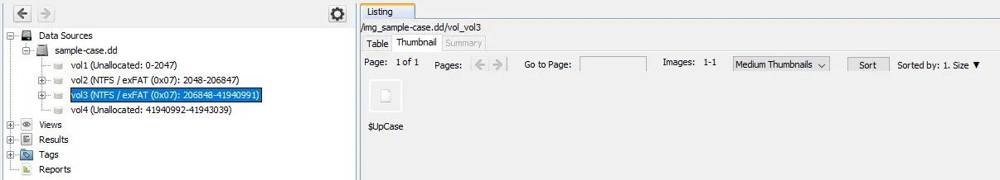

Các nút khối lượng có thể được mở rộng và nhà phân tích có thể điều hướng nội dung của khối lượng giống như một hệ thống Windows thông thường.

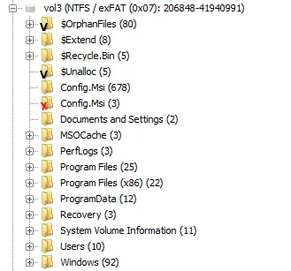

Trong nút cây Chế độ xem(Views tree) , các tệp được phân loại theo File Types — By Extension, By MIME Type, Deleted Files, and By File Size.

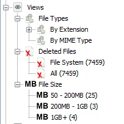

Mẹo : Khi nói đến Kiểu Tệp(File Types) , hãy chú ý đến phần này. Kẻ tấn công có thể đổi tên tệp với phần mở rộng tệp gây hiểu lầm. Vì vậy, tệp sẽ bị "phân loại sai" theo Phần Mở Rộng(By extension) nhưng sẽ được phân loại chính xác theo Loại MIME(MIME Type) . Mở rộng theo Phần Mở Rộng và nhiều nút con hơn sẽ xuất hiện, phân loại tệp chặt chẽ hơn nữa (xem bên dưới).

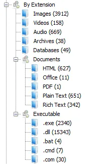

#### **3. Trình xem nội dung(Contents Viewer)**
Từ tab Bảng trong Trình xem kết quả, nếu bạn nhấp vào bất kỳ thư mục/tệp nào, thông tin bổ sung sẽ được hiển thị trong ngăn Contents Viewer.

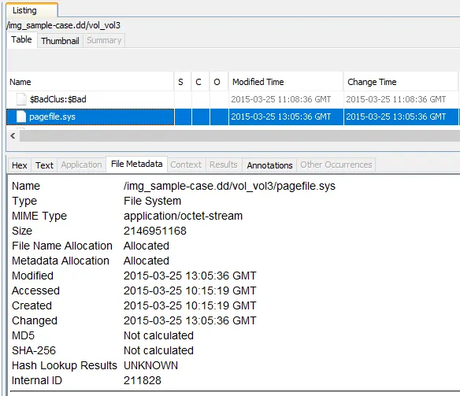

Trong hình ảnh này, có thể bạn sẽ không hiểu ngay được ý nghĩa của ba cột.

* S = Score
Điểm sẽ hiển thị dấu chấm than màu đỏ cho thư mục/tệp được đánh dấu/gắn thẻ là đáng chú ý và hình tam giác màu vàng hướng xuống dưới cho thư mục/tệp được đánh dấu/gắn thẻ là đáng ngờ. Các mục này có thể được đánh dấu/gắn thẻ bởi Mô-đun Nhập liệu hoặc nhà phân tích .

* C = Comment
Nếu trang màu vàng xuất hiện trong cột Bình luận, điều đó có nghĩa là có bình luận cho thư mục/tệp.

* O = Occurrence(Sự xuất hiện)
Tóm lại, cột này sẽ chỉ ra số lần tệp/thư mục này được nhìn thấy trong các trường hợp trước đây 

#### **4. Keyword Search**
Ở góc trên bên phải, bạn sẽ thấy Keyword Lists và Keyword Search . Với Keyword Search, nhà phân tích có thể thực hiện tìm kiếm từ khóa theo yêu cầu.

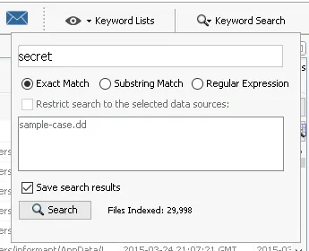

#### **V, Khu vực trạng thái(Status Area)**
Cuối cùng, Khu vực Trạng thái(Status Area) nằm ở góc dưới bên phải. Khi Mô-đun Nhập liệu(Ingest Module) chạy, thanh tiến trình (cùng với phần trăm hoàn thành) sẽ được hiển thị trong khu vực này. Thông tin chi tiết hơn về Mô-đun Nhập liệu sẽ được cung cấp nếu bạn nhấp vào thanh này.

Nếu nhấp vào **X**(ngay bên cạnh thanh tiến trình), một lời nhắc sẽ xuất hiện để xác nhận xem bạn có muốn kết thúc/hủy Mô-đun tiếp nhận hay không.

# **V, Giao diện người dùng II(The User Interface II)**
#### 1. Giao diện người dùng II
Hãy cùng xem xét nơi chúng ta có thể dễ dàng tìm thấy thông tin tóm tắt. Thông tin tóm tắt có thể giúp các nhà phân tích quyết định nên tập trung vào đâu bằng cách đánh giá các hiện vật hiện có. Chúng tôi khuyên bạn nên xem tóm tắt các nguồn dữ liệu trước khi bắt đầu điều tra. Nhờ đó, bạn có thể có cái nhìn tổng quan về hệ thống và các hiện vật hiện có.

#### 2. Tóm tắt nguồn dữ liệu(Data Source Summary)
Tóm tắt Nguồn Dữ liệu cung cấp thông tin tóm tắt theo chín danh mục khác nhau. Lưu ý rằng đây là tổng quan về tổng số phát hiện. Nếu bạn muốn tìm hiểu sâu hơn về các phát hiện và tìm kiếm một hiện vật cụ thể, bạn cần phân tích từng mô-đun riêng biệt bằng cách sử dụng "Trình xem Kết quả" được hiển thị trong nhiệm vụ trước.

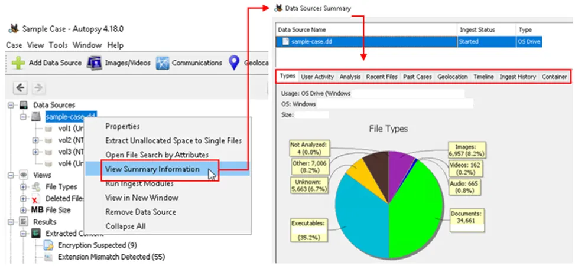

#### 3. Tạo báo cáo(Generate Report)
Bạn có thể tạo báo cáo về kết quả điều tra ở nhiều định dạng khác nhau, cho phép bạn tạo bảng dữ liệu cho trường hợp điều tra. Báo cáo cung cấp tất cả thông tin được liệt kê trong ngăn "Trình xem kết quả". Báo cáo có thể giúp bạn điều tra lại kết quả sau khi hoàn tất điều tra trực tiếp. Tuy nhiên, báo cáo không có tùy chọn tìm kiếm bổ sung, vì vậy bạn phải tự tìm kiếm hiện vật cho sự kiện quan tâm.

Mẹo: Công cụ Autopsy có thể khá nặng đối với các hệ thống có tài nguyên hạn chế. Do đó, việc hoàn thành điều tra bằng Autopsy trên tài nguyên hạn chế có thể chậm và khó khăn. Đặc biệt, việc duyệt các kết quả dài có thể khiến hệ thống bị treo. Bạn có thể tránh tình trạng này bằng cách sử dụng báo cáo. Bạn có thể sử dụng công cụ để phân tích dữ liệu và tạo báo cáo, sau đó tiếp tục phân tích thông qua báo cáo đã tạo mà không cần Autopsy. Lưu ý rằng việc tiến hành và quản lý điều tra bằng GUI luôn dễ dàng hơn.

Bạn có thể sử dụng tùy chọn "Tạo Báo cáo" để tạo báo cáo. Các bước được hiển thị bên dưới.

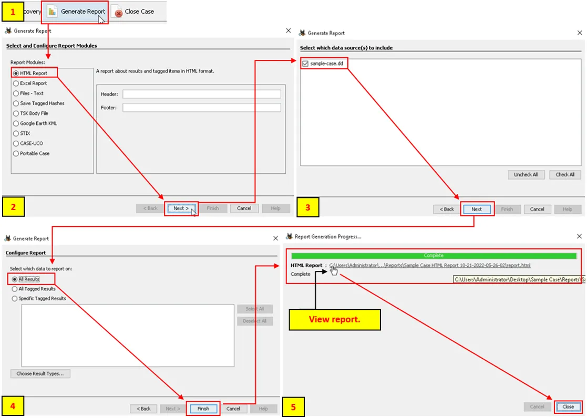

Sau khi bạn chọn định dạng và phạm vi báo cáo, Autopsy sẽ tạo báo cáo. Bạn có thể nhấp vào phần "Báo cáo HTML" (hiển thị ở trên) để xem báo cáo trên trình duyệt. Báo cáo chứa tất cả kết quả của ngăn "Trình xem kết quả" ở bên trái.

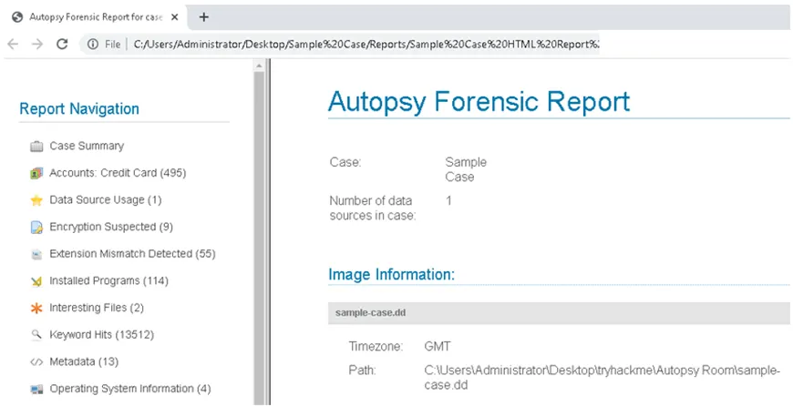

# **VI, Công cụ trực quan hóa(Visualisation Tools)**

