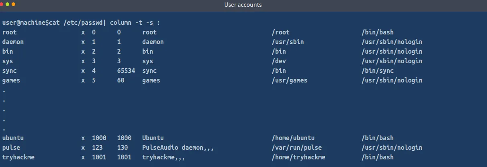
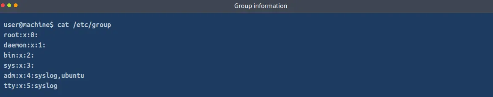
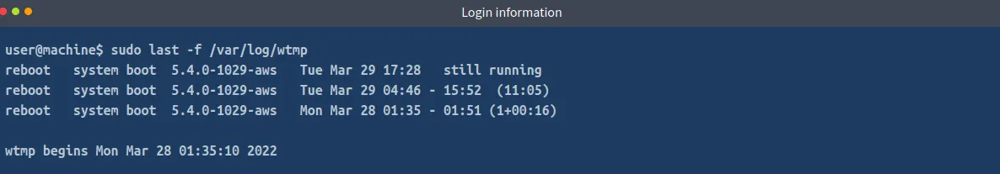

# **I, Thông tin hệ điều hành và tài khoản**
Đối với hệ thống Linux, mọi thứ được lưu trữ trong một tệp. Do đó, để xác định các hiện vật pháp y, chúng ta cần biết vị trí của các tệp này và cách đọc chúng. Dưới đây, chúng ta sẽ bắt đầu bằng cách xác định thông tin hệ thống trên máy chủ Linux.
#### 1. Thông tin phát hành hệ điều hành
Để tìm thông tin phát hành hệ điều hành, chúng ta có thể sử dụng **cat** tiện ích để đọc tệp nằm tại <pre>/etc/os-release.</pre>

#### 2. Tài khoản người dùng
Tệp này **/etc/passwd** chứa thông tin về các tài khoản người dùng hiện có trên hệ thống Linux. Chúng ta có thể sử dụng cattiện ích để đọc tệp này. Đầu ra bao gồm 7 trường được phân cách bằng dấu hai chấm, mô tả tên người dùng, thông tin mật khẩu, ID người dùng (uid), ID nhóm (gid), mô tả, thông tin thư mục home và shell mặc định được thực thi khi người dùng đăng nhập. Có thể thấy rằng giống như Windows, các tài khoản người dùng do người dùng tạo có UID từ 1000 trở lên. Bạn có thể sử dụng lệnh sau để dễ đọc hơn:

<pre>cat /etc/passwd| column -t -s :</pre>

Trong lệnh trên, chúng ta có thể thấy thông tin của người dùng ubuntu. Tên người dùng là ubuntu, trường thông tin mật khẩu hiển thị x, cho biết thông tin mật khẩu được lưu trữ trong /etc/shadowtệp. UID của người dùng là 1000. GID cũng là 1000. Phần mô tả, thường chứa tên đầy đủ hoặc thông tin liên hệ, đề cập đến tên Ubuntu. Thư mục home được đặt thành /home/ubuntu, và shell mặc định được đặt thành /bin/bash. Chúng ta cũng có thể thấy thông tin tương tự về những người dùng khác trong tệp.

#### 3. Thông tin nhóm
Tệp này /etc/group chứa thông tin về các nhóm người dùng khác nhau hiện diện trên máy chủ. Có thể đọc tệp này bằng tiện ích cat.

Ta có thể thấy người dùng này ubuntu thuộc adm nhóm có mật khẩu được lưu trong /etc/shadow tệp, được biểu thị bằng x ký tự. Gid là 4 và nhóm này bao gồm 2 người dùng, Syslog và Ubuntu.

#### 4. Danh sách Sudoers
Máy chủ Linux chỉ cho phép những người dùng nâng cao đặc quyền lên sudo, có trong danh sách Sudoers. Danh sách này được lưu trữ trong tệp /etc/sudoersvà có thể được đọc bằng cat tiện ích. Bạn sẽ cần nâng cao đặc quyền để truy cập tệp này.

#### 5. Thông tin đăng nhập
Trong thư mục **/var/log**, chúng ta có thể tìm thấy nhiều loại tệp nhật ký (log files) khác nhau, bao gồm **wtmp và btmp**.

Tệp **btmp** lưu thông tin về các lần đăng nhập thất bại, trong khi **wtmp** lưu dữ liệu lịch sử các lần đăng nhập.

Những tệp này không phải là tệp văn bản thông thường, nên không thể đọc được bằng các lệnh như cat, less, hoặc vim; thay vào đó, chúng là tệp nhị phân (binary files) và phải được đọc bằng tiện ích **last**.

#### 6. Nhật ký xác thực (Authentication logs)
Mỗi người dùng đăng nhập (xác thực) trên một máy chủ Linux đều được ghi lại trong nhật ký xác thực (auth log).
Nhật ký này là một tệp nằm tại đường dẫn **/var/log/auth.log**.

Tệp này có thể được đọc bằng tiện ích cat, tuy nhiên vì kích thước tệp thường khá lớn, chúng ta có thể sử dụng các tiện ích như **tail, head, more hoặc less** để giúp việc đọc dễ dàng hơn.

Trong tệp nhật ký ở trên, ta có thể thấy người dùng ubuntu đã nâng quyền vào lúc 17:49:52, ngày 29 tháng 3, bằng cách sử dụng sudo để chạy lệnh cat /etc/sudoers.
Ta cũng có thể thấy các sự kiện mở và đóng phiên làm việc tiếp theo của người dùng root, đây là kết quả của việc leo thang đặc quyền (privilege escalation) vừa được đề cập.

# **II, Cấu hình hệ thống (System Configuration)**
Khi chúng ta đã xác định được hệ điều hành và thông tin tài khoản, ta có thể bắt đầu xem xét cấu hình hệ thống của máy chủ (host).

#### 1. Tên máy (Hostname)
Tên máy được lưu trong tệp **/etc/hostname** trên hệ thống Linux.
Tệp này có thể được truy cập bằng cách sử dụng tiện ích cat.

<pre>user@machine$ cat /etc/hostname
tryhackme</pre>

#### 2. Múi giờ (Timezone)
Thông tin về múi giờ là một phần quan trọng, cho biết vị trí địa lý tổng quát của thiết bị hoặc khoảng thời gian mà thiết bị được sử dụng.
Thông tin múi giờ có thể được tìm thấy tại đường dẫn **/etc/timezone,** và có thể đọc được bằng tiện ích cat.

<pre>user@machine$ cat /etc/timezone
Etc/UTC</pre>

#### 3. Cấu hình mạng (Network Configuration)
Để tìm thông tin về các giao diện mạng (network interfaces), ta có thể dùng cat để đọc tệp **/etc/network/interfaces**.
Kết quả trên máy của bạn có thể khác so với ví dụ dưới đây, tùy vào cấu hình.

<pre>user@machine$ cat /etc/network/interfaces
# This file describes the network interfaces available on your system
# and how to activate them. For more information, see interfaces(5).

source /etc/network/interfaces.d/*

# The loopback network interface
auto lo
iface lo inet loopback

auto eth0
iface eth0 inet dhcp</pre>

Tương tự, để tìm thông tin về địa chỉ MAC và địa chỉ IP của các giao diện khác nhau, ta có thể dùng tiện ích ip.

#### 4. Kết nối mạng đang hoạt động(Active network connections)

Trên một hệ thống đang chạy, biết được các kết nối mạng đang hoạt động sẽ cung cấp ngữ cảnh bổ sung cho quá trình điều tra.
Ta có thể sử dụng tiện ích **netstat** để tìm các kết nối mạng đang hoạt động trên một máy chủ Linux.
Bạn có thể tìm hiểu thêm về tiện ích netstat bằng cách đọc trang hướng dẫn (man page) của nó.

#### 5. Các tiến trình đang chạy (Running processes)

Khi thực hiện phân tích pháp y (forensics) trên một hệ thống đang hoạt động, việc kiểm tra các tiến trình đang chạy là rất hữu ích.
Tiện ích **ps** hiển thị thông tin chi tiết về các tiến trình đang chạy.
Để tìm hiểu thêm về tiện ích ps, bạn có thể xem trang hướng dẫn (man page) của nó.

#### 6. Thông tin DNS (DNS information)
Tệp /etc/hosts chứa cấu hình cho việc gán tên DNS.
Chúng ta có thể dùng tiện ích cat để đọc nội dung của tệp này.
Để tìm hiểu thêm về tệp hosts, ta có thể dùng lệnh: 
<pre>man hosts</pre>

Thông tin về các máy chủ DNS mà hệ thống Linux sử dụng để phân giải tên miền (DNS resolution) được lưu trong tệp **resolv.conf**.
Vị trí của tệp này là **/etc/resolv.conf**, và ta có thể dùng tiện ích cat để đọc nội dung của nó.

# **III, Cơ chế duy trì truy cập (Persistence mechanisms)**
Khi đã nắm rõ môi trường mà ta đang điều tra, bước tiếp theo là tìm hiểu những cơ chế duy trì truy cập (persistence mechanisms) đang tồn tại trên máy chủ Linux được phân tích.
Persistence mechanisms là các phương thức cho phép một chương trình tồn tại và hoạt động ngay cả sau khi hệ thống được khởi động lại.
Điều này giúp tác giả mã độc có thể duy trì quyền truy cập vào hệ thống ngay cả sau khi nó được reboot.
Bây giờ, hãy cùng xem làm thế nào để nhận diện các cơ chế này trong hệ thống Linux.

#### 1. Cron jobs

Cron jobs là các lệnh được thiết lập để tự động chạy định kỳ sau một khoảng thời gian nhất định.
Máy chủ Linux lưu danh sách các cron jobs trong tệp **/etc/crontab.**
Ta có thể đọc nội dung tệp này bằng tiện ích cat.

#### 2. Service startup

Tương tự như trên Windows, trong Linux cũng có thể thiết lập các dịch vụ (services) để chúng khởi động và chạy nền mỗi khi hệ thống bật lên.
Danh sách các dịch vụ này có thể được tìm thấy trong thư mục **/etc/init.d.**
Ta có thể xem nội dung của thư mục này bằng lệnh ls.

#### 3. .bashrc

Khi một bash shell được khởi chạy, nó sẽ tự động thực thi các lệnh được lưu trong tệp .bashrc.
Tệp này có thể xem như danh sách các hành động khởi động cần thực hiện, vì vậy đây cũng là một vị trí tiềm năng để kiểm tra các cơ chế duy trì truy cập (persistence).

Các thiết lập trên toàn hệ thống được lưu trữ trong các tệp **/etc/bash.bashrc và /etc/profile** do đó, bạn nên xem qua các tệp này.

# **IV, Bằng chứng thực thi (Evidence of Execution)**
Biết được những chương trình nào đã được thực thi trên hệ thống là một trong những mục tiêu chính của phân tích pháp y (forensic analysis).
Trên một máy chủ Linux, ta có thể tìm thấy bằng chứng về việc thực thi chương trình từ các nguồn sau.

#### 1. Lịch sử thực thi với sudo (Sudo execution history)

Tất cả các lệnh được chạy trên máy chủ Linux bằng quyền sudo đều được lưu trong nhật ký xác thực (auth log). 

Ta có thể sử dụng tiện ích grep để lọc ra những thông tin cần thiết từ tệp auth log.

#### 2. Lịch sử Bash (Bash history)

Tất cả các lệnh được chạy không dùng sudo sẽ được lưu trong lịch sử bash (bash history).
Mỗi người dùng trong hệ thống sẽ có tệp bash history riêng, được lưu trong thư mục home của người dùng đó.

Vì vậy, khi kiểm tra lịch sử bash, ta cần thu thập tệp **.bash_history** từ thư mục home của từng người dùng.
Đặc biệt, cũng rất quan trọng phải kiểm tra lịch sử bash của người dùng root,
để ghi nhận toàn bộ các lệnh đã được thực thi với quyền root.
<pre>cat ~/.bash_history</pre>

#### 3. Các tệp được truy cập bằng Vim (Files accessed using Vim)

Trình soạn thảo Vim lưu lại nhật ký các tệp đã được mở trong tệp có tên **.viminfo**, nằm trong thư mục home của người dùng.
Tệp này chứa các thông tin như:

* Lịch sử dòng lệnh (command line history),
* Lịch sử tìm kiếm (search string history),
* Và các dữ liệu khác liên quan đến các tệp đã mở.

Ta có thể dùng tiện ích cat để xem nội dung của tệp .viminfo.
<pre>cat ~/.viminfo</pre>

# **V, Tệp nhật ký (Log files)**

Một trong những nguồn thông tin quan trọng nhất về các hoạt động diễn ra trên máy chủ Linux chính là các tệp nhật ký (log files).
Các tệp này lưu lại lịch sử hoạt động đã xảy ra trên hệ thống, và mức độ chi tiết của log phụ thuộc vào mức ghi log (logging level) được cấu hình.

Hãy cùng xem một số nguồn log quan trọng.
Thông thường, các tệp log được lưu trong thư mục **/var/log**.

#### 1. Syslog

Syslog chứa các thông báo mà hệ thống ghi lại về hoạt động của máy chủ.
Mức độ chi tiết của các thông báo này có thể được điều chỉnh thông qua logging level.

Ta có thể sử dụng tiện ích cat để xem nội dung Syslog, được lưu trong tệp **/var/log/syslog**.
Tuy nhiên, do Syslog thường rất lớn, nên ta có thể dùng tail, head, more, hoặc less để đọc dễ hơn.

Ta có thể thấy một số cron job được thực thi trong log, cùng với một vài hoạt động khác.
Ngoài ra, có thể thấy ký tự dấu sao (*) đi kèm sau syslog — điều này dùng để bao gồm cả các log đã được xoay vòng (rotated logs).
Theo thời gian, Linux sẽ luân phiên lưu các log cũ sang những tệp như syslog.1, syslog.2, v.v… để tránh làm syslog chính trở nên quá lớn.
Để tìm kiếm trong toàn bộ các log syslog, ta có thể dùng ký tự đại diện (*).

#### 2. Auth logs

Chúng ta đã nói về auth logs trong các nhiệm vụ trước.
Auth logs lưu thông tin về người dùng và các sự kiện liên quan đến xác thực (authentication).

#### 3. Nhật ký của bên thứ ba (Third-party logs)

Tương tự như syslog và auth log, thư mục /var/log/ cũng chứa nhật ký của các ứng dụng bên thứ ba,
chẳng hạn như máy chủ web (web server), cơ sở dữ liệu (database), hoặc máy chủ chia sẻ tệp (file share server).

Chúng ta có thể phân tích những log này bằng cách xem xét các tệp trong thư mục /var/log/.