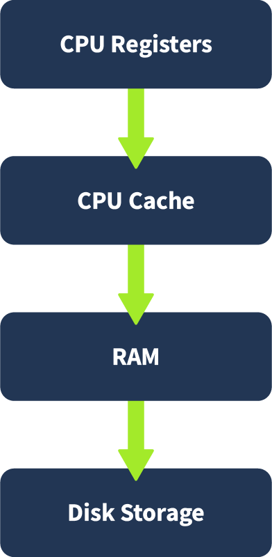
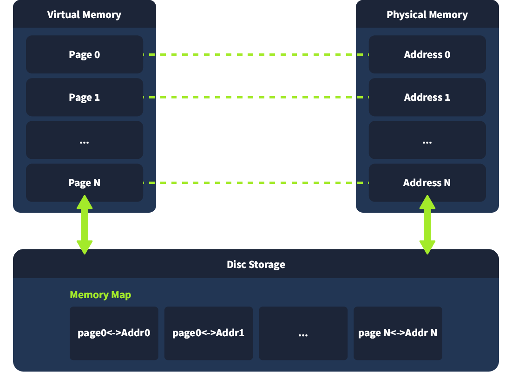
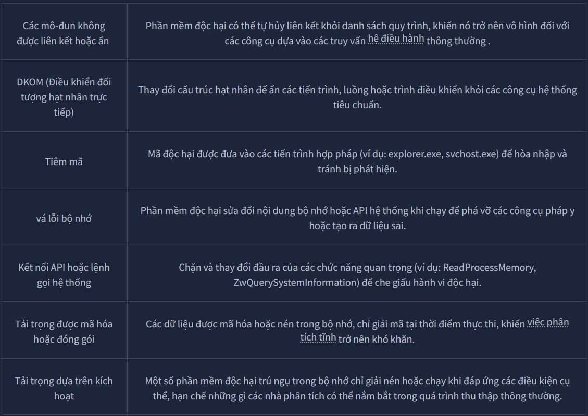

# **I, Volatile Memory(Bộ nhớ dễ bay hơi)**
#### 1. Volatile Memory
Bộ nhớ dễ bay hơi là dữ liệu được lưu trữ, chứa dữ liệu hệ thống và dữ liệu người dùng trong khi máy tính đang hoạt động. Khi hệ thống bị tắt nguồn hoặc khởi động lại, dữ liệu này sẽ bị mất. Một vị trí phổ biến cho loại bộ nhớ này là RAM ( Bộ nhớ Truy cập Ngẫu nhiên).

RAM lưu trữ tạm thời mọi thứ, từ các tệp đang mở và các quy trình đang chạy đến dữ liệu được mã hóa. Vì dữ liệu này chỉ tồn tại khi hệ thống đang hoạt động, các điều tra viên thường ưu tiên thu thập RAM càng sớm càng tốt trong quá trình điều tra.

#### 2. Memory Hierarchy(Hệ thống phân cấp bộ nhớ)
Máy tính lưu trữ và truy cập thông tin bằng cách sử dụng hệ thống phân cấp bộ nhớ, mỗi cấp độ cung cấp một sự cân bằng giữa tốc độ và dung lượng. Bắt đầu từ cấp nhanh nhất đến cấp chậm nhất, thứ tự là:

Thanh ghi CPU và bộ nhớ đệm cực kỳ nhanh nhưng có kích thước hạn chế. RAM là bộ nhớ làm việc chính cho hệ điều hành và các chương trình đang hoạt động. Lưu trữ đĩa, mặc dù chậm hơn nhiều, được sử dụng để lưu trữ dữ liệu lâu dài.

Mặt khác, khái niệm Bộ nhớ ảo (Virtual Memory) là một không gian bộ nhớ ảo. Khi một chương trình chạy, hệ điều hành sẽ gán cho nó các địa chỉ bộ nhớ ảo được ánh xạ tới RAM vật lý hoặc, nếu cần, tới không gian hoán đổi trên đĩa.

Swap là một vùng được dành riêng trên đĩa mà hệ điều hành sử dụng để lưu trữ dữ liệu từ RAM khi bộ nhớ vật lý tạm thời đầy. Điều này cho phép hệ thống xử lý nhiều tiến trình hoạt động hơn so với khả năng hỗ trợ của riêng RAM. Điều này cho phép các tiến trình chạy như thể chúng có bộ nhớ chuyên dụng trong khi hệ thống quản lý nơi lưu trữ dữ liệu thực tế. Hệ điều hành liên tục dịch chuyển dữ liệu giữa RAM và đĩa tùy thuộc vào tải và mức độ ưu tiên của hệ thống.

Những điều trên tác động đến phân tích bộ nhớ vì một số hiện vật pháp lý có thể nằm trong RAM trong khi những hiện vật khác có thể được lưu trữ tạm thời trong các tệp hoán đổi.

#### 3. Ram Structure
RAM thường là bộ nhớ mà các cuộc điều tra sẽ tập trung vào. Nó được chia thành hai vùng chính: Kernel space và User space.
* Kernel space : được dành riêng cho hệ điều hành và các dịch vụ cấp thấp. Nó quản lý các tài nguyên như trình điều khiển thiết bị và truy cập bộ nhớ.
* User space : chứa các tiến trình do người dùng hoặc ứng dụng khởi chạy. Mỗi tiến trình có một không gian riêng biệt, được bảo vệ khỏi các tiến trình khác.

Trong một quy trình của người dùng, bộ nhớ thường được cấu trúc thành nhiều vùng:
* Stack : Lưu trữ dữ liệu tạm thời như đối số hàm và địa chỉ trả về. Nó tăng hoặc giảm kích thước khi hàm được gọi và trả về.
* Heap : Được sử dụng để phân bổ bộ nhớ động trong thời gian chạy, chẳng hạn như các đối tượng và bộ đệm do chương trình tạo ra.
* Executable(Tệp thực thi) (.text) : Lưu trữ mã hoặc lệnh thực tế mà CPU chạy.
* Data sections(Phần dữ liệu) : Không gian để lưu trữ các biến toàn cục và dữ liệu khác mà chương trình thực thi cần.

Việc hiểu cấu trúc này rất quan trọng trong việc xác định vị trí các hiện vật pháp y. Ví dụ, khóa mã hóa thường nằm trên heap, trong khi lệnh shell có thể nằm trên stack.

#### 4.  RAM for Forensic Analysts
Phân tích RAM cung cấp cái nhìn tổng quan về hoạt động của hệ thống tại một thời điểm cụ thể. Điều này bao gồm:
* Tiến trình đang chạy và các tệp thực thi đã tải
* Mở kết nối mạng và cổng
* Người dùng đã đăng nhập và các lệnh gần đây
* Nội dung được giải mã, bao gồm cả khóa mã hóa
* Mã bị tiêm hoặc phần mềm độc hại không có tệp

Vì tất cả thông tin này sẽ biến mất khi hệ thống tắt, phân tích bộ nhớ mang đến cơ hội duy nhất để quan sát hệ thống đang hoạt động. Nó thường tiết lộ bằng chứng không có trong phân tích pháp y ổ đĩa, đặc biệt là đối với các cuộc tấn công không ghi tệp vào ổ đĩa.

Điều này khiến bộ nhớ trở thành mục tiêu ưu tiên trong quá trình ứng phó sự cố, đặc biệt là khi xử lý hệ thống trực tiếp, điều tra phần mềm độc hại hoặc nghi ngờ xâm nhập.

Phân tích pháp y bộ nhớ thường được sử dụng sớm trong quá trình điều tra để thu thập dữ liệu bị mất khi tắt máy. Nó giúp người ứng cứu thu thập các quy trình đang hoạt động, kết nối mạng và các hiện vật trực tiếp khác trước khi chúng bị mất.

Phân tích này rất hữu ích khi xử lý các mối đe dọa trong bộ nhớ, phần mềm độc hại không có tệp hoặc đánh cắp thông tin đăng nhập. Phân tích bộ nhớ cung cấp ảnh chụp nhanh về hoạt động của hệ thống, có thể hỗ trợ quá trình điều tra.

# **II, Memory Dumps**
Memory dump là ảnh chụp nhanh RAM của hệ thống tại một thời điểm cụ thể. Nó ghi lại mọi thứ được lưu trữ trong bộ nhớ tạm, bao gồm các quy trình đang chạy, phiên hoạt động, hoạt động mạng và đôi khi thậm chí cả dữ liệu nhạy cảm như thông tin đăng nhập.

Bản sao lưu bộ nhớ (memory dump) được sử dụng rộng rãi cho phân tích pháp y, điều tra phần mềm độc hại và săn tìm mối đe dọa. Các nhóm bảo mật phân tích các ảnh chụp nhanh này để hiểu những gì đang chạy trên hệ thống và phát hiện hoạt động đáng ngờ hoặc trái phép. Các công cụ như Mimikatz thường được các nhóm đỏ và kẻ tấn công sử dụng để trích xuất thông tin đăng nhập trực tiếp từ bộ nhớ, khiến bản sao lưu bộ nhớ trở thành một trọng tâm phòng thủ quan trọng.

#### 1. How Memory Dumps are Created
Việc tạo bản sao lưu bộ nhớ phụ thuộc vào hệ điều hành đang sử dụng. Mục tiêu là thu thập nội dung RAM mà không làm thay đổi đáng kể nội dung đó trong quá trình thu thập.

Trên Windows, các công cụ như crash dump tích hợp sẵn, RAMMap của Sysinternals, hoặc các tiện ích của bên thứ ba như WinPmem và FTK Imager có thể được sử dụng để tạo các bản ghi bộ nhớ đầy đủ hoặc chọn lọc. Một số phương pháp bao gồm các bản ghi chế độ kernel nằm tại <mark>%SystemRoot%\MEMORY.DMP</mark> và các tệp ngủ đông được lưu trữ dưới dạng <mark>%SystemDrive%\hiberfil.sys</mark>.

Trên Linux và macOS, các nhà phân tích có thể sử dụng các công cụ như LiME ( Trích xuất Bộ nhớ Linux ) hoặc dd với quyền truy cập vào <mark>/dev/mem</mark> hoặc <mark>/proc/kcore</mark>, tùy thuộc vào các biện pháp bảo vệ kernel.

#### 2. Types of Memory Dumps
Phạm vi và mục đích của việc sao lưu bộ nhớ có thể khác nhau:
* Full Memory Dump : Ghi lại toàn bộ RAM , bao gồm cả không gian người dùng và nhân. Hữu ích cho việc điều tra pháp y toàn diện và phân tích phần mềm độc hại.
* Process Dump: Ghi lại bộ nhớ của một tiến trình đang chạy. Hữu ích cho việc thiết kế ngược hoặc cô lập hành vi độc hại trong một ứng dụng cụ thể.
* Pagefile and Swap Analysis : Hệ thống sẽ chuyển một số nội dung bộ nhớ sang đĩa khi RAM đầy. Trên Windows, nội dung này được lưu trữ trong tệp trang.sys, và trên Linux , trong phân vùng hoán đổi hoặc tệp hoán đổi. Chúng có thể chứa các đoạn dữ liệu đã từng nằm trong RAM , cung cấp thêm ngữ cảnh.

Trong một số trường hợp, tệp ngủ đông của hệ thống (hiberfil.sys) cũng có thể được phân tích cú pháp để trích xuất nội dung RAM được lưu khi máy tính chuyển sang chế độ ngủ đông. Bạn có thể tìm hiểu thêm thông tin trong bài viết này <a href = "https://diverto.github.io/2019/11/05/Extracting-Passwords-from-hiberfil-and-memdumps">Link</a>.

#### 3. Challenges in Memory Acquisition(Những thách thức trong việc thu thập bộ nhớ)
Việc có được một bản sao lưu bộ nhớ sạch và đáng tin cậy đi kèm với một số thách thức. Kẻ tấn công có thể triển khai các kỹ thuật chống điều tra pháp y để can thiệp vào các công cụ ghi lại bộ nhớ hoặc ẩn sự hiện diện của chúng trong RAM . Các ví dụ phổ biến bao gồm:

Các phương pháp này yêu cầu các nhà phân tích phải vượt ra ngoài các công cụ mặc định và sử dụng kỹ thuật khắc bộ nhớ, kiểm tra cấp độ hạt nhân và các kỹ thuật dựa trên hành vi để khám phá hoạt động ẩn.

Các kỹ thuật mã hóa và làm tối nghĩa cũng được sử dụng để làm cho nội dung bộ nhớ khó diễn giải hơn. Các tải trọng được mã hóa hoặc các khối mã nén có thể được lưu trữ trong bộ nhớ và chỉ được giải mã khi chạy, điều này làm tăng thêm độ phức tạp cho quá trình phân tích.

# **III, Memory Analysis Attack Fingerprints(Dấu vân tay tấn công phân tích bộ nhớ)**
#### 1. Memory-Based Threat Indicators(Chỉ số đe dọa dựa trên bộ nhớ)
Phân tích bộ nhớ đặc biệt hiệu quả trong việc phát hiện các mối đe dọa có thể không để lại dấu vết trên đĩa. Trong khi nhật ký và hệ thống tệp cung cấp bằng chứng lâu dài, bộ nhớ lại tiết lộ những gì đang xảy ra ngay lúc đó, khiến nó trở nên thiết yếu để xác định các cuộc tấn công đang hoạt động hoặc mới được thực hiện.

Các hiện vật phổ biến nhất mà các nhà phân tích tìm kiếm trong bộ nhớ bao gồm :
* Các tiến trình đáng ngờ hoặc độc hại đang chạy mà không có tệp tương ứng trên đĩa.
* Tiêm DLL là việc tiêm mã độc vào không gian bộ nhớ của một tiến trình hợp pháp.
* Làm rỗng quy trình, một kỹ thuật trong đó bộ nhớ của một quy trình đáng tin cậy được thay thế bằng mã độc hại.
* API hooking, được sử dụng để chặn hoặc thay đổi các lệnh gọi hàm thông thường nhằm ẩn hoạt động hoặc thao túng hành vi của hệ thống.
* Rootkit, đặc biệt là những rootkit hoạt động trong không gian hạt nhân, có khả năng thao túng cấu trúc bộ nhớ để ẩn tệp, quy trình hoặc kết nối mạng.

Các kỹ thuật này thường để lại các dấu hiệu bộ nhớ cụ thể—chẳng hạn như vùng bộ nhớ bất thường, tiêu đề PE không khớp hoặc thực thi mã trong các vùng bộ nhớ có thể ghi—có thể được phát hiện bằng các công cụ pháp y.
#### 2. Quyền truy cập thông tin xác thực ( MITER ATT&CK: T1003)(Credential Access (MITRE ATT&CK: T1003))
<mark>T1071 – Giao thức Lớp Ứng dụng: Lệnh và Kiểm soát.</mark>
Phần mềm độc hại hiện đại thường giao tiếp với máy chủ bên ngoài mà không thả tệp. Phần mềm độc hại không tệp này sử dụng các tải trọng nằm trong bộ nhớ để lấy lệnh hoặc trích xuất dữ liệu thông qua các giao thức chuẩn như HTTP , HTTPS hoặc DNS . Trong bộ nhớ, các nhà phân tích có thể tìm thấy các cấu hình C2 , địa chỉ IP hoặc beacon đã được giải mã mà không được ghi lại ở bất kỳ nơi nào khác để cố gắng tìm kiếm các hiện vật.

#### 3. Thực thi tập lệnh trong bộ nhớ (T1086)(In-Memory Script Execution (T1086))
<mark>T1086 – Các tập lệnh PowerShell</mark>
được thực thi trực tiếp từ bộ nhớ khó theo dõi hơn vì chúng không tác động đến đĩa. Kẻ tấn công sử dụng PowerShell hoặc các trình thông dịch khác (ví dụ: Python, WMI ) để thực thi mã trong RAM . Phân tích bộ nhớ có thể tiết lộ toàn bộ nội dung tập lệnh, lệnh được mã hóa hoặc các hiện tượng bất thường trong bộ nhớ quy trình PowerShell .

#### 4. Kỹ thuật bền bỉ trong bộ nhớ(Persistence Techniques in Memory)
Các cơ chế duy trì này có thể được xác định bằng cách phát hiện các hiện tượng liên quan trong quá trình phân tích bộ nhớ trực tiếp:

<mark>T1053.005 – Tác vụ/Công việc theo Lịch trình :</mark>
Tác vụ theo Lịch trình tạo các tác vụ thực thi theo khoảng thời gian hoặc khởi động. Trong quá trình  phân tích bộ nhớ, chúng tôi có thể tìm kiếm các tiến trình như schtasks.exe và các chuỗi bộ nhớ chứa tên tác vụ hoặc đường dẫn tải trọng độc hại.

<mark>T1543.003 – Tạo hoặc Sửa đổi Quy trình Hệ thống: Dịch vụ Windows</mark>
Các dịch vụ độc hại có thể chạy ngầm dưới dạng services.exe. Chúng tôi có thể tìm thấy tên dịch vụ, tệp nhị phân hoặc cấu hình bất thường trong bộ nhớ có thể liên quan đến kỹ thuật này.

<mark>T1547.001 – Khóa Chạy Registry / Thư mục Khởi động :</mark>
Phần mềm độc hại thêm các mục vào HKCU\Software\Microsoft\Windows\CurrentVersion\Run để thực thi khi khởi động. Các giá trị này thường có thể được khôi phục từ bộ nhớ hoặc tìm thấy trong các ổ đĩa registry được lưu trong bộ nhớ đệm RAM .

#### 5. Chuyển động ngang thông qua các hiện vật bộ nhớ(Lateral Movement via Memory Artifacts)
Phân tích pháp y bộ nhớ cũng có thể phát hiện các nỗ lực di chuyển ngang qua các hệ thống. Các kỹ thuật phổ biến bao gồm :

<mark>T1021.002 – Dịch vụ Từ xa: Chia sẻ Quản trị SMB /Windows (PsExec)</mark>
PsExec cho phép thực thi lệnh trên các hệ thống từ xa. Các nhà phân tích có thể tìm thấy các dịch vụ liên quan đến PsExec hoặc các đối số dòng lệnh trong bộ nhớ cho thấy sự dịch chuyển ngang.

<mark>T1021.006 – Dịch vụ Từ xa: Quản lý Từ xa Windows (WinRM)</mark>
WinRM cung cấp tính năng điều khiển từ xa PowerShell . Hãy tìm wsmprovhost.exe và tham chiếu bộ nhớ để khởi tạo phiên từ xa.

<mark>T1059.001 – Trình thông dịch lệnh và tập lệnh: PowerShell (Từ xa)</mark>
PowerShell thường được sử dụng để thực thi lệnh từ xa. Các nhà phân tích có thể phát hiện các lệnh được mã hóa base64 hoặc được mã hóa ẩn trong bộ nhớ của quy trình PowerShell .

<mark>T1047 – Công cụ Quản lý Windows (WMI)</mark>
WMI như lệnh wmic process call create có thể được sử dụng để tạo các tiến trình từ xa. Chuỗi lệnh hoặc tham chiếu lớp liên quan có thể được lưu trong bộ nhớ đệm.