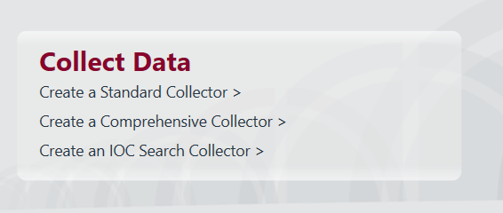

# **I, Data collection**
Có ba cách hoặc tùy chọn để thu thập dữ liệu bằng Redline :

1. Bộ thu thập tiêu chuẩn  - phương pháp này cấu hình tập lệnh để thu thập lượng dữ liệu tối thiểu cho quá trình phân tích. Đây sẽ là phương pháp chúng tôi ưu tiên sử dụng để thu thập dữ liệu trong phòng này. Đây cũng thường là phương pháp nhanh nhất để thu thập dữ liệu bạn cần. Quá trình này chỉ mất vài phút để hoàn tất.
2. Trình thu thập toàn diện  - phương pháp này cấu hình tập lệnh để thu thập tối đa dữ liệu từ máy chủ của bạn để phân tích sâu hơn. Phương pháp này mất khoảng một giờ hoặc hơn. Bạn nên chọn phương pháp này nếu muốn phân tích toàn bộ hệ thống.
3. Trình thu thập tìm kiếm  IOC (chỉ dành cho Windows) - phương pháp này thu thập dữ liệu khớp với các  Chỉ số xâm phạm (IOC)  mà bạn đã tạo bằng  IOC Editor . Bạn sẽ chọn phương pháp này nếu muốn chạy thu thập dữ liệu dựa trên các IOC đã biết mà bạn thu thập được thông qua thông tin tình báo về mối đe dọa (nguồn cấp dữ liệu hoặc báo cáo tường thuật), phản hồi sự cố hoặc phân tích phần mềm độc hại.