# **I, Windows Registry and Forensics**
#### **Windows Registry:**
Windows Registry là một tập hợp các cơ sở dữ liệu chứa dữ liệu cấu hình hệ thống. Dữ liệu cấu hình này có thể liên quan đến phần cứng, phần mềm hoặc thông tin người dùng. Nó cũng bao gồm dữ liệu về các tệp, chương trình đã sử dụng hoặc thiết bị được kết nối với hệ thống. Như bạn có thể thấy, dữ liệu này rất hữu ích cho việc phân tích dữ liệu. Trong suốt buổi học này, chúng ta sẽ tìm hiểu các cách đọc dữ liệu này để xác định thông tin cần thiết về hệ thống. Bạn có thể xem registry bằng regedit.exe, một tiện ích tích hợp sẵn của Windows để xem và chỉnh sửa registry.

Sổ đăng ký Windows bao gồm Khóa và Giá trị. Khi bạn mở tiện ích regedit.exe để xem sổ đăng ký, các thư mục bạn thấy là Khóa Đăng ký. Giá trị Đăng ký là dữ liệu được lưu trữ trong các Khóa Đăng ký này. Registry Hive là một nhóm Khóa, khóa con và giá trị được lưu trữ trong một tệp duy nhất trên đĩa.

#### **Structure of the Registry:**
Sổ đăng ký trên bất kỳ hệ thống Windows nào cũng chứa năm khóa gốc sau:
* HKEY_CURRENT_USER
* HKEY_USERS
* HKEY_LOCAL_MACHINE
* HKEY_CLASSES_ROOT
* HKEY_CURRENT_CONFI

Chúng ta có thể xem các khóa này khi mở regedit.exe tiện ích.
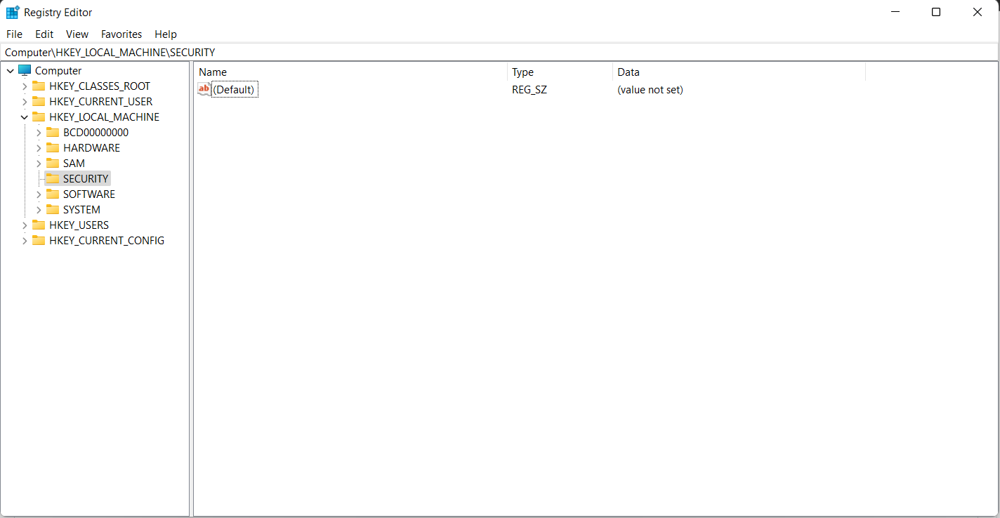 

Định nghĩa từng khóa gốc :

# **II, Accessing registry hives offline**
Nếu bạn đang truy cập hệ thống trực tiếp, bạn sẽ có thể truy cập sổ đăng ký bằng regedit.exe và sẽ được chào đón với tất cả các khóa gốc tiêu chuẩn mà chúng ta đã tìm hiểu trong bài tập trước. Tuy nhiên, nếu bạn chỉ có quyền truy cập vào ảnh đĩa, bạn phải biết các hive registry nằm ở đâu trên đĩa. Phần lớn các hive này nằm trong **C:\Windows\System32\Config** thư mục và:
1. DEFAULT (mounted on HKEY_USERS\DEFAULT)
2. SAM (mounted on HKEY_LOCAL_MACHINE\SAM)
3. SECURITY (mounted on HKEY_LOCAL_MACHINE\Security)
4. SOFTWARE (mounted on HKEY_LOCAL_MACHINE\Software)
5. SYSTEM (mounted on HKEY_LOCAL_MACHINE\System)

#### **Hives chứa thông tin người dùng**
Ngoài các hive này, hai hive khác chứa thông tin người dùng có thể được tìm thấy trong thư mục Hồ sơ người dùng. Đối với Windows 7 trở lên, thư mục hồ sơ người dùng nằm ở **C:\Users\<username>\** vị trí của các hive:

1. NTUSER.DAT (được gắn trên HKEY_CURRENT_USER khi người dùng đăng nhập)
2. USRCLASS.DAT (được gắn trên HKEY_CURRENT_USER\Software\CLASSES)

The USRCLASS.DAT hive is located in the directory **C:\Users\<username>\AppData\Local\Microsoft\Windows.**

The NTUSER.DAT hive is located in the directory **C:\Users\<username>\.**

NTUSER.DAT and USRCLASS.DAT là các tệp ẩn

#### **The Amcache Hive:**
Ngoài các tệp này, còn có một hive rất quan trọng khác gọi là hive AmCache. hive này nằm trong thư mục  **C:\Windows\AppCompat\Programs\Amcache.hve**. Windows tạo hive này để lưu trữ thông tin về các chương trình đã chạy gần đây trên hệ thống.

## **Nhật ký giao dịch và bản sao lưu:**
Một số nguồn dữ liệu pháp y quan trọng khác là nhật ký giao dịch và bản sao lưu sổ đăng ký. Nhật ký giao dịch có thể được coi là nhật ký thay đổi của tổ hợp sổ đăng ký. Windows thường sử dụng nhật ký giao dịch khi ghi dữ liệu vào tổ hợp sổ đăng ký. Điều này có nghĩa là nhật ký giao dịch thường có thể chứa những thay đổi mới nhất trong sổ đăng ký mà chưa được đưa vào chính tổ hợp sổ đăng ký. Nhật ký giao dịch cho mỗi tổ hợp được lưu trữ dưới dạng tệp **.LOG** trong cùng thư mục với chính tổ hợp. Tệp này có cùng tên với tổ hợp sổ đăng ký, nhưng phần mở rộng là **.LOG**. Ví dụ: nhật ký giao dịch cho tổ hợp **SAM** sẽ nằm trong **C:\Windows\System32\Config** tên tệp **SAM.LOG**. Đôi khi cũng có thể có nhiều nhật ký giao dịch. Trong trường hợp đó, chúng sẽ có phần mở rộng là **.LOG1, .LOG2, v.v**. Vì vậy, cần thận trọng khi xem xét nhật ký giao dịch khi thực hiện pháp y sổ đăng ký.

Sao lưu Registry trái ngược với Nhật ký giao dịch. Đây là bản sao lưu của các hive registry nằm trong  **C:\Windows\System32\Config** thư mục. Các hive này được sao chép vào  **C:\Windows\System32\Config\RegBack** thư mục mười ngày một lần. Đây có thể là một nơi tuyệt vời để kiểm tra nếu bạn nghi ngờ một số khóa registry có thể đã bị xóa/sửa đổi gần đây.

# **III, Thông tin hệ thống và tài khoản hệ thống**
#### 1. Phiên bản hệ điều hành :
Để tìm phiên bản hệ điều hành , chúng ta có thể sử dụng khóa sổ đăng ký sau:
<pre>SOFTWARE\Microsoft\Windows NT\CurrentVersion</pre>
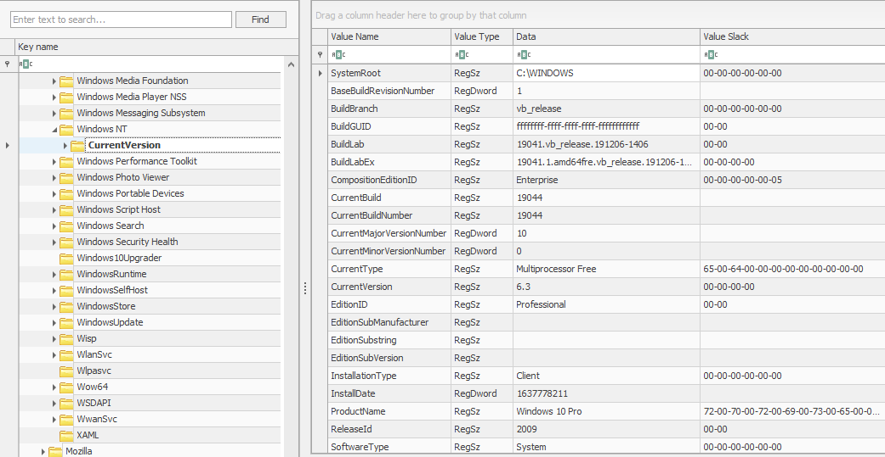

#### 2. Bộ điều khiển hiện tại :
Các hive chứa dữ liệu cấu hình máy được sử dụng để điều khiển khởi động hệ thống được gọi là Control Set. Thông thường, chúng ta sẽ thấy hai Control Set, ControlSet001 và ControlSet002, trong hive HỆ THỐNG trên một máy. Trong hầu hết các trường hợp (nhưng không phải luôn luôn), ControlSet001 sẽ trỏ đến Control Set mà máy đã khởi động, và ControlSet002 sẽ là cấu hình last known good. Vị trí của chúng sẽ là:

<pre>SYSTEM\ControlSet001

SYSTEM\ControlSet002</pre>

Windows tạo một **Control Set** dễ bay hơi khi máy tính đang hoạt động, được gọi là **CurrentControlSet (HKLM\SYSTEM\CurrentControlSet)**. Để có được thông tin hệ thống chính xác nhất, đây là hive mà chúng ta sẽ tham chiếu đến. Chúng ta có thể tìm ra **Control Set** nào đang được sử dụng làm **CurrentControlSet** bằng cách xem giá trị registry sau:

<pre>SYSTEM\Select\Current</pre>

Tương tự như vậy, cấu hình **last known good** có thể được tìm thấy bằng cách sử dụng registry value sau:

<pre>SYSTEM\Select\LastKnownGood</pre>

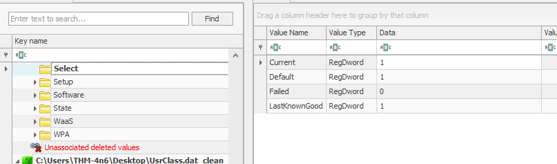

#### 3. Tên máy tính :
Việc xác định Tên Máy tính khi thực hiện phân tích pháp y là rất quan trọng để đảm bảo chúng ta đang làm việc trên đúng máy tính cần xử lý. Chúng ta có thể tìm thấy Tên Máy tính tại vị trí sau:

<pre>SYSTEM\CurrentControlSet\Control\ComputerName\ComputerName</pre>  

#### 4. Thông tin múi giờ :
Để chính xác, điều quan trọng là phải xác định máy tính đang ở múi giờ nào. Điều này sẽ giúp chúng ta hiểu được trình tự thời gian của các sự kiện khi chúng xảy ra. Để tìm Thông tin Múi giờ, chúng ta có thể xem vị trí sau:

<pre>SYSTEM\CurrentControlSet\Control\TimeZoneInformation</pre>

#### 5. Giao diện mạng và mạng trước đây :
Khóa đăng ký sau đây sẽ cung cấp danh sách các giao diện mạng trên máy mà chúng ta đang điều tra:

<pre>SYSTEM\CurrentControlSet\Services\Tcpip\Parameters\Interfaces</pre>

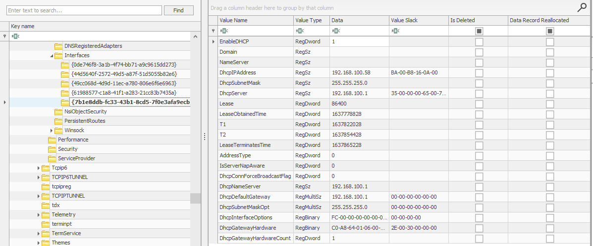

Mỗi Giao diện được biểu diễn bằng một khóa con định danh duy nhất (GUID), chứa các giá trị liên quan đến cấu hình TCP /IP của giao diện. Khóa này sẽ cung cấp cho chúng ta thông tin như địa chỉ IP, địa chỉ IP DHCP và Mặt nạ mạng con, Máy chủ DNS , v.v. Thông tin này rất quan trọng vì nó giúp bạn đảm bảo rằng mình đang thực hiện phân tích pháp y trên máy tính mà bạn cần thực hiện.

Các mạng trước đây mà máy tính đã kết nối có thể được tìm thấy ở các vị trí sau:

<pre>SOFTWARE\Microsoft\Windows NT\CurrentVersion\NetworkList\Signatures\Unmanaged
SOFTWARE\Microsoft\Windows NT\CurrentVersion\NetworkList\Signatures\Managed</pre>

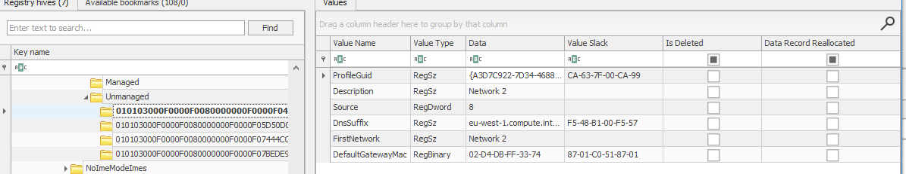

#### 6. Chương trình tự động khởi động (Autoruns) :
Các khóa đăng ký sau đây bao gồm thông tin về các chương trình hoặc lệnh chạy khi người dùng đăng nhập. 

<pre>NTUSER.DAT\Software\Microsoft\Windows\CurrentVersion\Run

NTUSER.DAT\Software\Microsoft\Windows\CurrentVersion\RunOnce

SOFTWARE\Microsoft\Windows\CurrentVersion\RunOnce

SOFTWARE\Microsoft\Windows\CurrentVersion\policies\Explorer\Run

SOFTWARE\Microsoft\Windows\CurrentVersion\Run</pre>

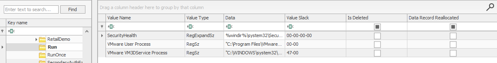

Khóa đăng ký sau đây chứa thông tin về các dịch vụ:

<pre>SYSTEM\CurrentControlSet\Services</pre>

Lưu ý Giá trị của phím Start trong ảnh chụp màn hình bên dưới.

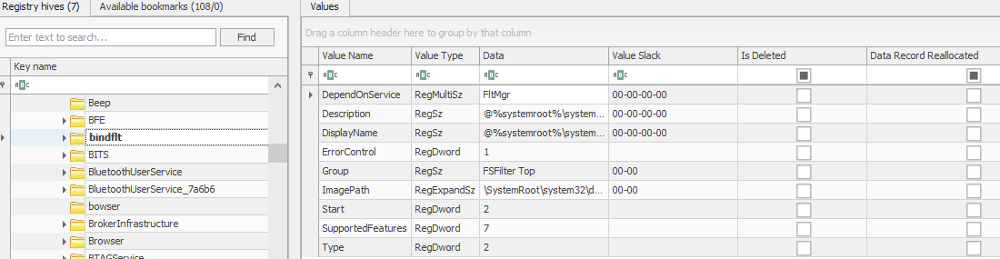

Trong khóa sổ đăng ký này, nếu start   khóa được đặt thành 0x02, điều này có nghĩa là dịch vụ này sẽ khởi động khi khởi động.

#### 6. Thông tin về SAM Hive và người dùng :
SAM Hive chứa thông tin tài khoản người dùng, thông tin đăng nhập và thông tin nhóm. Thông tin này chủ yếu nằm ở vị trí sau:

<pre>SAM\Domains\Account\Users</pre>

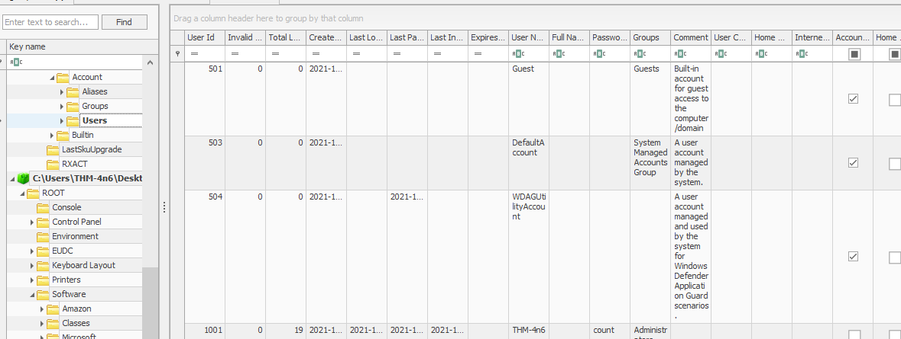

Thông tin có ở đây bao gồm mã định danh tương đối (RID) của người dùng, số lần người dùng đăng nhập, thời gian đăng nhập gần nhất, lần đăng nhập không thành công gần nhất, lần thay đổi mật khẩu gần nhất, ngày hết hạn mật khẩu, chính sách mật khẩu và gợi ý mật khẩu, cũng như bất kỳ nhóm nào mà người dùng là thành viên. 

# **IV, Usage or knowledge of files/folders**
#### 1. Các tập tin gần đây :
Windows duy trì một danh sách các tệp đã mở gần đây cho mỗi người dùng. Như chúng ta có thể thấy khi sử dụng Windows Explorer, nó hiển thị danh sách các tệp đã sử dụng gần đây. Thông tin này được lưu trữ trong NTUSER hive và có thể được tìm thấy tại vị trí sau:

<pre>NTUSER.DAT\Software\Microsoft\Windows\CurrentVersion\Explorer\RecentDocs</pre>

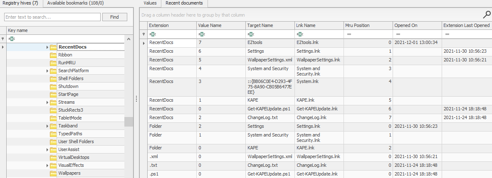

Registry Explorer cho phép chúng ta sắp xếp dữ liệu chứa trong các khóa registry một cách nhanh chóng. Ví dụ: tab Tài liệu gần đây sẽ sắp xếp tệp Được sử dụng gần đây nhất (MRU) lên đầu danh sách. Registry Explorer cũng sắp xếp chúng sao cho tệp Được sử dụng gần đây nhất (MRU) được hiển thị ở đầu danh sách và các tệp cũ hơn được hiển thị ở sau.

Một thông tin thú vị khác trong khóa registry này là có nhiều khóa khác nhau với phần mở rộng tệp, chẳng hạn như  .pdf , .jpg , .docx  v.v. Các khóa này cung cấp cho chúng ta thông tin về các tệp được sử dụng gần đây nhất có phần mở rộng tệp cụ thể. Vì vậy, nếu chúng ta đang tìm kiếm cụ thể các tệp PDF được sử dụng gần đây nhất, chúng ta có thể xem khóa registry sau:

<pre>NTUSER.DAT\Software\Microsoft\Windows\CurrentVersion\Explorer\RecentDocs\.pdf</pre>

Registry Explorer cũng liệt kê thời gian mở gần nhất của các tệp.

#### 2. Tệp tin gần đây của Office :
Tương tự như Recent Docs được Windows Explorer duy trì, Microsoft Office cũng duy trì danh sách các tài liệu đã mở gần đây. Danh sách này cũng nằm trong NTUSER hive. Bạn có thể tìm thấy nó ở vị trí sau:

<pre>NTUSER.DAT\Software\Microsoft\Office\VERSION</pre>

Số phiên bản cho mỗi bản phát hành Microsoft Office là khác nhau. Khóa sổ đăng ký ví dụ sẽ trông như thế này:

<pre>NTUSER.DAT\Software\Microsoft\Office\15.0\Word</pre>

Ở đây, 15.0 đề cập đến Office 2013. Danh sách các bản phát hành Office khác nhau và số phiên bản của chúng có thể được tìm thấy tại liên kết này https://learn.microsoft.com/en-us/microsoft-365-apps/deploy/install-different-office-visio-and-project-versions-on-the-same-computer#office-releases-and-their-version-number.

Bắt đầu từ Office 365, Microsoft hiện liên kết vị trí với ID trực tiếp của người dùng . Trong trường hợp này, các tệp gần đây có thể được tìm thấy tại vị trí sau. 

<pre>NTUSER.DAT\Software\Microsoft\Office\VERSION\UserMRU\LiveID_####\FileMRU</pre>

Trong trường hợp này, các tệp gần đây có thể được tìm thấy tại vị trí sau. Vị trí này cũng lưu đường dẫn đầy đủ của các tệp được sử dụng gần đây nhất.

#### 3. ShellBags :
Khi bất kỳ người dùng nào mở một thư mục, nó sẽ mở theo một bố cục cụ thể. Người dùng có thể thay đổi bố cục này tùy theo sở thích. Các bố cục này có thể khác nhau đối với các thư mục khác nhau. Thông tin về "shell" Windows  được lưu trữ và có thể xác định các tệp và thư mục Được sử dụng Gần đây nhất. Vì thiết lập này khác nhau đối với mỗi người dùng, nên nó nằm trong nhóm người dùng. Chúng ta có thể tìm thấy thông tin này ở các vị trí sau:

<pre>USRCLASS.DAT\Local Settings\Software\Microsoft\Windows\Shell\Bags

USRCLASS.DAT\Local Settings\Software\Microsoft\Windows\Shell\BagMRU

NTUSER.DAT\Software\Microsoft\Windows\Shell\BagMRU

NTUSER.DAT\Software\Microsoft\Windows\Shell\Bags</pre>

Registry Explorer không cung cấp nhiều thông tin về ShellBags. Tuy nhiên, một công cụ khác của Eric Zimmerman có tên ShellBag Explorer sẽ hiển thị thông tin theo định dạng dễ sử dụng. Chúng ta chỉ cần trỏ đến tệp hive đã trích xuất, và nó sẽ phân tích dữ liệu và hiển thị kết quả.

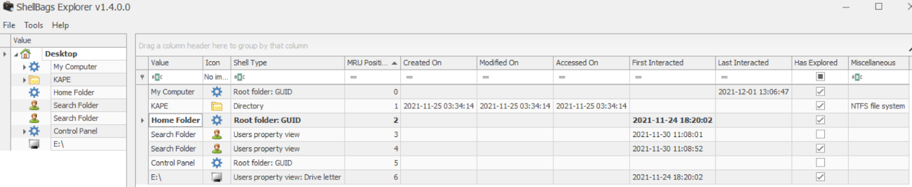

#### 4. MRU hộp thoại Mở/Lưu và Truy cập lần cuối :
Khi chúng ta mở hoặc lưu một tệp, một hộp thoại sẽ xuất hiện hỏi chúng ta muốn lưu hoặc mở tệp đó từ đâu. Có thể nhận thấy rằng khi chúng ta mở/lưu tệp tại một vị trí cụ thể, Windows sẽ ghi nhớ vị trí đó. Điều này có nghĩa là chúng ta có thể tìm ra các tệp đã sử dụng gần đây nếu có được thông tin này. Chúng ta có thể làm như vậy bằng cách kiểm tra các khóa registry sau:

<pre>NTUSER.DAT\Software\Microsoft\Windows\CurrentVersion\Explorer\ComDlg32\OpenSavePIDlMRU

NTUSER.DAT\Software\Microsoft\Windows\CurrentVersion\Explorer\ComDlg32\LastVisitedPidlMRU</pre>

#### 5. Thanh địa chỉ/tìm kiếm của Windows Explorer :
Một cách khác để xác định hoạt động gần đây của người dùng là xem các đường dẫn được nhập vào thanh địa chỉ của Windows Explorer hoặc các tìm kiếm được thực hiện bằng các khóa đăng ký sau.

<pre>NTUSER.DAT\Software\Microsoft\Windows\CurrentVersion\Explorer\TypedPaths

NTUSER.DAT\Software\Microsoft\Windows\CurrentVersion\Explorer\WordWheelQuery</pre>

Khóa TypedPaths trông như thế này trong Registry Explorer:

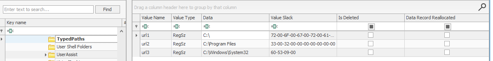

# **V, Bằng chứng thực hiện**
#### 1. Trợ lý người dùng :

Windows theo dõi các ứng dụng được người dùng khởi chạy bằng Windows Explorer cho mục đích thống kê trong các khóa registry của User Assist. Các khóa này chứa thông tin về các chương trình đã khởi chạy, thời gian khởi chạy và số lần thực thi. Tuy nhiên, các chương trình được chạy bằng dòng lệnh không thể tìm thấy trong các khóa User Assist. Khóa User Assist nằm trong hive NTUSER, được ánh xạ đến GUID của mỗi người dùng. Chúng ta có thể tìm thấy khóa này tại vị trí sau:

<pre>NTUSER.DAT\Software\Microsoft\Windows\Currentversion\Explorer\UserAssist\{GUID}\Count</pre>

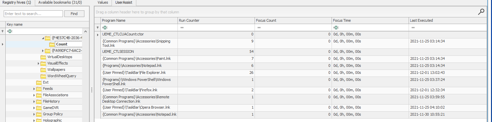

#### 2. ShimCache :
ShimCache là một cơ chế được sử dụng để theo dõi khả năng tương thích của ứng dụng với hệ điều hành và theo dõi tất cả các ứng dụng được khởi chạy trên máy. Mục đích chính của nó trong Windows là đảm bảo khả năng tương thích ngược của các ứng dụng. Nó còn được gọi là Bộ đệm Tương thích Ứng dụng (AppCompatCache). Nó nằm ở vị trí sau trong SYSTEM hive:

<pre>SYSTEM\CurrentControlSet\Control\Session Manager\AppCompatCache</pre>

ShimCache lưu trữ tên tệp, kích thước tệp và thời gian sửa đổi cuối cùng của tệp thực thi.

Công cụ goto của chúng tôi, Registry Explorer, không phân tích cú pháp dữ liệu ShimCache theo định dạng dễ đọc, vì vậy chúng tôi chuyển sang một công cụ khác có tên là AppCompatCache Parser, cũng là một phần trong bộ công cụ của Eric Zimmerman. Công cụ này lấy SYSTEM hive làm đầu vào, phân tích cú pháp dữ liệu và xuất ra tệp CSV trông như thế này:

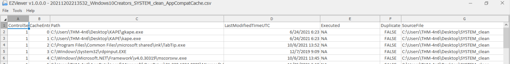

Chúng ta có thể sử dụng lệnh sau để chạy Tiện ích phân tích cú pháp AppCompatCache:

<pre>AppCompatCacheParser.exe --csv <=path to save output> -f <=path to SYSTEM hive for data parsing> -c <=control set to parse></pre>

Có thể xem kết quả bằng EZviewer, một công cụ khác của Eric Zimmerman.

AmCache:

#### 3. AmCache:

hive AmCache là một hiện vật liên quan đến ShimCache. Nó thực hiện chức năng tương tự như ShimCache và lưu trữ dữ liệu bổ sung liên quan đến việc thực thi chương trình. Dữ liệu này bao gồm đường dẫn thực thi, thời gian cài đặt, thực thi và xóa, cũng như mã băm SHA1 của các chương trình đã thực thi. hive này nằm trong hệ thống tệp tại:

<pre>C:\Windows\appcompat\Programs\Amcache.hve</pre>

Thông tin về các chương trình được thực thi gần đây nhất có thể được tìm thấy tại vị trí sau trong hive:

<pre>Amcache.hve\Root\File\{Volume GUID}\</pre>

Đây là cách Registry Explorer phân tích cú pháp AmCache hive:

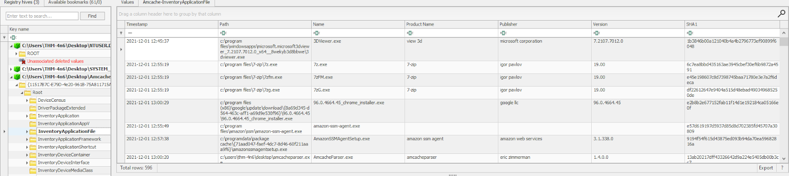

#### 4. BAM/DAM:
Background Activity Monitor or BAM theo dõi hoạt động của các ứng dụng nền. Trình điều tiết hoạt động màn hình nền tương tự (DAM) là một phần của Microsoft Windows, giúp tối ưu hóa mức tiêu thụ điện năng của thiết bị. Cả hai đều là một phần của hệ thống Modern Standby trong Microsoft Windows.

Trong sổ đăng ký Windows, các vị trí sau đây chứa thông tin liên quan đến BAM và DAM. Vị trí này chứa thông tin về các chương trình chạy gần đây nhất, đường dẫn đầy đủ của chúng và thời gian thực thi gần nhất.

<pre>SYSTEM\CurrentControlSet\Services\bam\UserSettings\{SID}

SYSTEM\CurrentControlSet\Services\dam\UserSettings\{SID}</pre>

Dưới đây bạn có thể thấy cách Registry Explorer phân tích dữ liệu từ BAM:

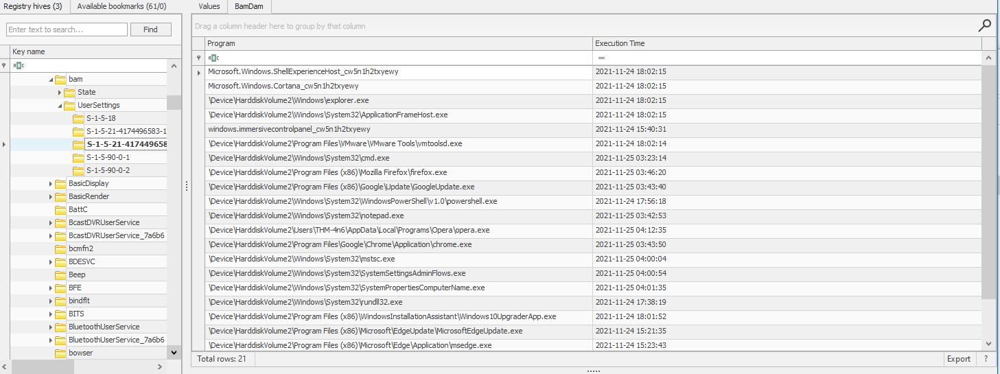

# **VI, Thiết bị ngoài/Thiết bị USB giám định**
Khi thực hiện giám định trên máy tính, nhu cầu thường nảy sinh là xác định xem có USB hoặc ổ đĩa di động nào được gắn vào máy hay không. Nếu có, bất kỳ thông tin nào liên quan đến các thiết bị đó đều rất quan trọng đối với điều tra viên giám định. Trong bài tập này, chúng ta sẽ tìm hiểu các cách khác nhau để tìm thông tin về các thiết bị được kết nối và ổ đĩa trên hệ thống bằng cách sử dụng sổ đăng ký.

#### 1, Nhận dạng thiết bị :
Các vị trí sau đây theo dõi các khóa USB được cắm vào hệ thống. Các vị trí này lưu trữ ID nhà cung cấp, ID sản phẩm và phiên bản của thiết bị USB được cắm vào và có thể được sử dụng để xác định các thiết bị duy nhất. Các vị trí này cũng lưu trữ thời gian các thiết bị được cắm vào hệ thống.

<pre>SYSTEM\CurrentControlSet\Enum\USBSTOR

SYSTEM\CurrentControlSet\Enum\USB</pre>

#### 2, Lần đầu tiên/lần cuối cùng :
Tương tự như vậy, khóa đăng ký sau đây theo dõi lần đầu tiên thiết bị được kết nối, lần cuối cùng thiết bị được kết nối và lần cuối cùng thiết bị được gỡ khỏi hệ thống.

<pre>SYSTEM\CurrentControlSet\Enum\USBSTOR\Ven_Prod_Version\USBSerial#\Properties\{83da6326-97a6-4088-9453-a19231573b29}\####</pre>

Trong khóa này, dấu #### có thể được thay thế bằng các chữ số sau để có được thông tin cần thiết:
<pre>0064	Thời gian kết nối đầu tiên
0066	Thời gian kết nối cuối cùng
0067	Thời gian gỡ bỏ cuối cùng</pre>

Mặc dù chúng ta có thể kiểm tra giá trị này theo cách thủ công, như đã thấy ở trên, Registry Explorer đã phân tích dữ liệu này và hiển thị cho chúng ta nếu chúng ta chọn khóa USBSTOR.

#### 3, Tên ổ đĩa thiết bị USB :
Tên thiết bị của ổ đĩa được kết nối có thể được tìm thấy tại vị trí sau:

<pre>SOFTWARE\Microsoft\Windows Portable Devices\Devices</pre>

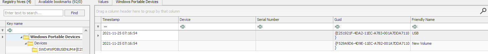

Chúng ta có thể so sánh GUID mà chúng ta thấy trong khóa registry này và so sánh nó với Disk ID mà chúng ta thấy trên các khóa được đề cập trong phần nhận dạng thiết bị để đối chiếu tên với các thiết bị duy nhất.

# **VII, Hệ thống tập tin FAT**
Thiết bị lưu trữ trong hệ thống máy tính, ví dụ như ổ đĩa cứng hoặc thiết bị USB, chỉ là một tập hợp các bit. Để chuyển đổi các bit này thành thông tin có ý nghĩa, chúng cần được sắp xếp. Vì mục đích này, các nhà khoa học máy tính và kỹ sư đã tạo ra các hệ thống tệp khác nhau để sắp xếp các bit trong ổ cứng theo một tiêu chuẩn, nhờ đó thông tin được lưu trữ trong các bit này có thể được diễn giải dễ dàng.

#### 1. Bảng phân bổ tệp (FAT) :
Bảng Phân bổ Tệp (FAT) là một trong những hệ thống tệp này. Nó đã là hệ thống tệp mặc định cho Hệ điều hành Microsoft kể từ ít nhất là cuối những năm 1970 và vẫn đang được sử dụng, mặc dù không còn là mặc định nữa. Đúng như tên gọi, Bảng Phân bổ Tệp tạo ra một bảng lập chỉ mục vị trí của các bit được phân bổ cho các tệp khác nhau.

#### 2. Cấu trúc dữ liệu của hệ thống tập tin FAT :
Hệ thống tập tin FAT hỗ trợ các cấu trúc dữ liệu sau :

**Các cụm :** Cụm là đơn vị lưu trữ cơ bản của hệ thống tệp FAT. Mỗi tệp được lưu trữ trên thiết bị lưu trữ có thể được coi là một nhóm các cụm chứa các bit thông tin.

**Thư mục** : Thư mục chứa thông tin về nhận dạng tệp, như tên tệp, cụm bắt đầu và độ dài tên tệp.

**Bảng phân bổ tệp** : Bảng Phân bổ Tệp là danh sách được liên kết của tất cả các cụm. Nó chứa trạng thái của cụm và con trỏ đến cụm tiếp theo trong chuỗi.

Tóm lại, các bit tạo nên một tệp được lưu trữ theo cụm. Tất cả tên tệp trên một hệ thống tệp, cụm khởi đầu và độ dài của chúng được lưu trữ trong các thư mục. Vị trí của mỗi cụm trên đĩa được lưu trữ trong Bảng Phân bổ Tệp. Chúng ta có thể thấy rằng chúng ta đã bắt đầu với một đĩa thô được tạo thành từ các bit và sắp xếp nó để xác định nhóm bit nào tham chiếu đến tệp nào được lưu trữ trên đĩa.

#### 3. FAT12, FAT16 và FAT32:
Định dạng tệp FAT chia không gian đĩa khả dụng thành các cụm để việc định địa chỉ trở nên đơn giản hơn. Số lượng các cụm này phụ thuộc vào số bit được sử dụng để định địa chỉ cụm. Do đó, có nhiều biến thể khác nhau của hệ thống tệp FAT. FAT ban đầu được phát triển với địa chỉ cụm 8 bit, và được gọi là Cấu trúc FAT. Sau đó, khi cần tăng dung lượng lưu trữ, FAT12, FAT16 và FAT32 đã được giới thiệu.

Về mặt lý thuyết, FAT12 sử dụng địa chỉ cụm 12 bit cho tối đa 4096 cụm (2¹²). FAT16 sử dụng địa chỉ cụm 16 bit cho tối đa 65.536 cụm (2¹⁶). Trong trường hợp FAT32, số bit thực tế được sử dụng để định địa chỉ cụm là 28, do đó số cụm tối đa thực tế là 268.435.456 hoặc 2²⁸. Tuy nhiên, không phải tất cả các cụm này đều được sử dụng để lưu trữ tệp. Một số được sử dụng cho mục đích quản trị, ví dụ: để lưu trữ phần cuối của chuỗi cụm, các phần không sử dụng được của đĩa, hoặc các mục đích tương tự khác.

<pre>Thuộc tính	                   FAT12	   FAT16	FAT32
Bit có thể định địa chỉ	             12	             16	          28
Số lượng cụm tối đa	            4.096	   65.536     268.435.456
Kích thước cụm được hỗ trợ	 512B - 8KB	 2KB - 32KB	4KB - 32KB
Kích thước khối lượng tối đa	    32MB	     2GB	 2TB</pre>

Mặc dù dung lượng ổ đĩa tối đa cho FAT32 là 2TB, Windows chỉ giới hạn định dạng ở mức 32GB. Tuy nhiên, Windows vẫn hỗ trợ các ổ đĩa được định dạng trên các hệ điều hành khác có dung lượng lớn hơn.

Ngày nay, khả năng bắt gặp hệ thống tệp FAT12 rất hiếm. FAT16 và FAT32 vẫn được sử dụng ở một số nơi, chẳng hạn như ổ USB, thẻ SD hoặc máy ảnh kỹ thuật số. Tuy nhiên, dung lượng ổ đĩa tối đa và kích thước tệp tối đa (4GB - 1 tệp cho cả FAT16 và FAT32) là những yếu tố hạn chế khiến việc sử dụng chúng bị hạn chế.

#### 4. Hệ thống tập tin exFAT:
Khi kích thước tệp ngày càng tăng, đặc biệt là khi hình ảnh và video có độ phân giải cao hơn được hỗ trợ bởi các máy ảnh kỹ thuật số mới hơn, giới hạn kích thước tệp tối đa FAT32 đã trở thành một yếu tố hạn chế đáng kể đối với các nhà sản xuất máy ảnh. Mặc dù Microsoft đã chuyển sang hệ thống tệp NTFS, nhưng nó không phù hợp với các thiết bị đa phương tiện kỹ thuật số vì chúng không cần các tính năng bảo mật bổ sung và chi phí đi kèm. Do đó, các nhà sản xuất này đã vận động Microsoft tạo ra hệ thống tệp exFAT.

Hệ thống tệp exFAT hiện là mặc định cho thẻ SD lớn hơn 32GB. Nó cũng đã được hầu hết các nhà sản xuất thiết bị kỹ thuật số áp dụng rộng rãi. Hệ thống tệp exFAT hỗ trợ kích thước cụm từ 4KB đến 32MB. Nó có kích thước tệp tối đa và kích thước ổ đĩa tối đa là 128PB (Petabyte). Nó cũng giảm bớt một số chi phí của hệ thống tệp FAT, giúp nó nhẹ hơn và hiệu quả hơn. Nó có thể chứa tối đa 2.796.202 tệp trên mỗi thư mục.

# **VIII, Hệ thống tập tin NTFS**
Như đã đề cập trước đó, FAT là một hệ thống tệp rất cơ bản. Để đáp ứng nhu cầu bảo mật, độ tin cậy, khả năng phục hồi, khả năng quản lý kích thước tệp và ổ đĩa , Microsoft đã phát triển một hệ thống tệp mới hơn có tên là Hệ thống Tệp Công nghệ Mới (NTFS). Hệ thống này được giới thiệu vào năm 1993 cùng với Windows NT 3.1 nhưng đã trở nên phổ biến kể từ Windows XP.

#### 1. Tính năng NTFS :
* **Viết nhật ký**
Hệ thống tệp NTFS lưu trữ nhật ký về các thay đổi đối với siêu dữ liệu trong ổ đĩa. Tính năng này giúp hệ thống phục hồi sau sự cố hoặc di chuyển dữ liệu do phân mảnh. Nhật ký này được lưu trữ trong $LOGFILE trong thư mục gốc của ổ đĩa. Do đó, hệ thống tệp NTFS được gọi là hệ thống tệp nhật ký.

* **Kiểm soát truy cập**
Hệ thống tệp FAT không có quyền kiểm soát truy cập dựa trên người dùng. Hệ thống tệp NTFS có quyền kiểm soát truy cập xác định chủ sở hữu của tệp/thư mục và quyền cho từng người dùng.

* **Bản sao bóng khối lượng**
Hệ thống tệp NTFS theo dõi các thay đổi được thực hiện trên tệp bằng tính năng gọi là Bản sao Bóng Khối lượng (Volume Shadow Copies). Nhờ tính năng này, người dùng có thể khôi phục các phiên bản tệp trước đó để phục hồi hoặc khôi phục hệ thống. Trong các cuộc tấn công ransomware gần đây, ransomware được ghi nhận đã xóa các bản sao bóng trên hệ thống tệp của nạn nhân để ngăn họ khôi phục dữ liệu.

* **Luồng dữ liệu thay thế**
Tệp là một luồng dữ liệu được tổ chức trong một hệ thống tệp. Luồng dữ liệu luân phiên (ADS) là một tính năng trong NTFS cho phép tệp có nhiều luồng dữ liệu được lưu trữ trong một tệp duy nhất. Internet Explorer và các trình duyệt khác sử dụng Luồng Dữ liệu Luân phiên để xác định các tệp được tải xuống từ internet (sử dụng Mã định danh Vùng ADS). Phần mềm độc hại cũng được phát hiện ẩn mã của chúng trong ADS.

* **Bảng tập tin chính**
Giống như Bảng Phân bổ Tệp, NTFS cũng có Bảng Tệp Chính (Master File Table). Tuy nhiên, Bảng Tệp Chính, hay MFT, có phạm vi rộng hơn nhiều so với Bảng Phân bổ Tệp. Đây là một cơ sở dữ liệu có cấu trúc theo dõi các đối tượng được lưu trữ trong một ổ đĩa. Do đó, có thể nói rằng dữ liệu hệ thống tệp NTFS được tổ chức trong Bảng Tệp Chính. Về mặt pháp lý, sau đây là một số tệp quan trọng trong MFT:

    * **MFT**
MFT là bản ghi đầu tiên trong ổ đĩa. Bản ghi Khởi động Ổ đĩa (VBR) trỏ đến cụm nơi nó được đặt. $MFT lưu trữ thông tin về các cụm nơi tất cả các đối tượng khác có mặt trên ổ đĩa được đặt. Tệp này chứa một thư mục chứa tất cả các tệp có trên ổ đĩa.

    * **LOGFILE**
LOGFILE lưu trữ nhật ký giao dịch của hệ thống tệp. Nó giúp duy trì tính toàn vẹn của hệ thống tệp trong trường hợp xảy ra sự cố.

    * **UsnJrnl**
Đây là viết tắt của Nhật ký Số thứ tự Cập nhật (USN). Nhật ký này nằm trong bản ghi $Extend. Nó chứa thông tin về tất cả các tệp đã được thay đổi trong hệ thống tệp và lý do thay đổi. Nhật ký này còn được gọi là nhật ký thay đổi.

#### 2. Trình khám phá MFT
Tiếp tục, MFT Explorer là một trong những công cụ của Eric Zimmerman dùng để khám phá các tệp MFT. Công cụ này có sẵn cả trong CLI và GUI.

<pre>user@machine$ MFTECmd.exe

MFTECmd version 0.5.0.1

Author: Eric Zimmerman (saericzimmerman@gmail.com)
https://github.com/EricZimmerman/MFTECmd

        f               File to process ($MFT | $J | $LogFile | $Boot | $SDS). Required
        m               $MFT file to use when -f points to a $J file (Use this to resolve parent path in $J CSV output).
  
  json            Directory to save JSON formatted results to. This or --csv required unless --de or --body is specified
        jsonf           File name to save JSON formatted results to. When present, overrides default name
        csv             Directory to save CSV formatted results to. This or --json required unless --de or --body is specified
        csvf            File name to save CSV formatted results to. When present, overrides default name
...</pre>

MFTECmd phân tích dữ liệu từ các tệp khác nhau được tạo bởi hệ thống tệp NTFS như $MFT, $Boot, v.v. Ảnh chụp màn hình ở trên cho thấy các tùy chọn có sẵn để phân tích tệp MFT. Để phân tích tệp $MFT, chúng ta có thể sử dụng lệnh sau:

<pre>MFTECmd.exe -f <=path-to-$MFT-file> --csv <=path-to-save-results-in-csv></pre>

Sau đó, bạn có thể sử dụng công cụ EZviewer trong thư mục EZtools để xem kết quả đầu ra của MFTECmd, hoặc để xem các tệp CSV trong các tác vụ tiếp theo. Bạn sẽ thấy công cụ này liệt kê thông tin về tất cả các tệp có trên ổ đĩa. Tương tự, bạn có thể phân tích cú pháp tệp $Boot, tệp này sẽ cung cấp thông tin về sector khởi động của ổ đĩa. Hiện tại, MFTECmd chưa hỗ trợ $LOGFILE.

# **IX, Khôi phục các tệp tin đã xóa**
Hiểu về hệ thống tệp giúp bạn dễ dàng biết được cách thức tệp bị xóa, khôi phục và xóa. Như đã tìm hiểu trong hai bài học trước, hệ thống tệp lưu trữ vị trí của tệp trên đĩa trong một bảng hoặc cơ sở dữ liệu. Khi xóa tệp khỏi hệ thống tệp, hệ thống tệp sẽ xóa các mục lưu trữ vị trí của tệp trên đĩa. Đối với hệ thống tệp, vị trí tệp đã tồn tại giờ đây có thể được ghi hoặc hủy phân bổ. Tuy nhiên, nội dung tệp trên đĩa vẫn còn đó, miễn là chúng không bị ghi đè bởi hệ thống tệp trong khi sao chép tệp khác hoặc bởi chương trình cơ sở đĩa trong khi bảo trì đĩa.

Tương tự, dữ liệu trên đĩa nằm trong các cụm chưa được phân bổ khác nhau, có thể được phục hồi. Để phục hồi dữ liệu này, chúng ta phải hiểu cấu trúc tệp của các loại tệp khác nhau để xác định tệp cụ thể thông qua dữ liệu chúng ta thấy trong trình soạn thảo hex. Tuy nhiên, chúng ta sẽ không đề cập đến điều đó trong bài này. Điều chúng ta sẽ làm là sử dụng một công cụ thực hiện việc này và xác định các tệp đã xóa trong tệp ảnh đĩa.

#### 1. Hình ảnh đĩa
Ảnh đĩa là một tệp chứa bản sao từng bit của ổ đĩa, bao gồm tất cả siêu dữ liệu của hệ thống tệp, trong một tệp duy nhất. Do đó, khi thực hiện giám định pháp y, việc tạo nhiều bản sao của một bằng chứng vật lý là rất hữu ích:

1. Bằng chứng gốc không bị ô nhiễm
2. Tệp hình ảnh đĩa có thể được sao chép và phân tích mà không cần sử dụng bất kỳ phần cứng chuyên dụng nào .

#### 2. Khôi phục tập tin bằng Autopsy

# **X, Bằng chứng thực hiện**
#### 1. Tệp Windows Prefetch
Khi một chương trình được chạy trong Windows, nó sẽ lưu trữ thông tin để sử dụng trong tương lai. Thông tin được lưu trữ này được sử dụng để tải chương trình nhanh chóng trong trường hợp sử dụng thường xuyên. Thông tin này được lưu trữ trong các tệp prefetch nằm trong C:\Windows\Prefetchthư mục.

Tệp prefetch có phần mở rộng là .pf. Tệp prefetch chứa thông tin về thời gian chạy gần nhất của ứng dụng, số lần ứng dụng được chạy và bất kỳ tệp và thiết bị nào được tệp sử dụng. Do đó, nó là một nguồn thông tin tuyệt vời về các chương trình và tệp được thực thi gần nhất.

Chúng ta có thể sử dụng Prefetch Parser (PECmd.exe) từ công cụ của Eric Zimmerman để phân tích cú pháp các tệp Prefetch và trích xuất dữ liệu. Khi chạy PECmd.exe trong dấu nhắc lệnh nâng cao, chúng ta sẽ nhận được kết quả sau:

<pre>user@machine$ PECmd.exe

PECmd version 1.4.0.0

Author: Eric Zimmerman (saericzimmerman@gmail.com)
https://github.com/EricZimmerman/PECmd

        d               Directory to recursively process. Either this or -f is required
        f               File to process. Either this or -d is required
        k               Comma separated list of keywords to highlight in output. By default, 'temp' and 'tmp' are highlighted. Any additional keywords will be added to these.
        o               When specified, save prefetch file bytes to the given path. Useful to look at decompressed Win10 files
        q               Do not dump full details about each file processed. Speeds up processing when using --json or --csv. Default is FALSE

        json            Directory to save json representation to.
        jsonf           File name to save JSON formatted results to. When present, overrides default name
        csv             Directory to save CSV results to. Be sure to include the full path in double quotes
        csvf            File name to save CSV formatted results to. When present, overrides default name
...

Examples: PECmd.exe -f <=path-to-Prefetch-files> --csv <=path-to-save-csv>
          PECmd.exe -f "C:\Temp\CALC.EXE-3FBEF7FD.pf"
          PECmd.exe -f "C:\Temp\CALC.EXE-3FBEF7FD.pf" --json "D:\jsonOutput" --jsonpretty
          PECmd.exe -d "C:\Temp" -k "system32, fonts"
          PECmd.exe -d "C:\Temp" --csv "c:\temp" --csvf foo.csv --json c:\temp\json
          PECmd.exe -d "C:\Windows\Prefetch"</pre>

Để chạy Prefetch Parser trên một tệp và lưu kết quả vào tệp CSV, chúng ta có thể sử dụng lệnh sau:

<pre>PECmd.exe -f <=path-to-Prefetch-files> --csv <=path-to-save-csv></pre>

Tương tự như vậy, để phân tích toàn bộ thư mục, chúng ta có thể sử dụng lệnh sau:

<pre>PECmd.exe -d <=path-to-Prefetch-directory> --csv <=path-to-save-csv></pre>

#### 2. Windows 10 Timeline
Windows 10 lưu trữ các ứng dụng và tệp được sử dụng gần đây trong cơ sở dữ liệu SQLite được gọi là Dòng thời gian Windows 10. Dữ liệu này có thể là nguồn thông tin về các chương trình được thực thi gần đây nhất. Nó bao gồm ứng dụng đã được thực thi và thời gian tập trung của ứng dụng. Bạn có thể tìm thấy Dòng thời gian Windows 10 tại vị trí sau:

<pre>C:\Users\<=username>\AppData\Local\ConnectedDevicesPlatform\{randomfolder}\ActivitiesCache.db</pre>

Chúng ta có thể sử dụng WxTCmd.exe của Eric Zimmerman để phân tích cú pháp Windows 10 Timeline. Khi chạy, chúng ta sẽ nhận được các tùy chọn sau:

<pre>user@machine$ WxTCmd.exe

WxTCmd version 0.6.0.0

Author: Eric Zimmerman (saericzimmerman@gmail.com)
https://github.com/EricZimmerman/WxTCmd

        f               File to process. Required
        csv             Directory to save CSV formatted results to. Be sure to include the full path in double quotes
        dt              The custom date/time format to use when displaying timestamps. See https://goo.gl/CNVq0k for options. Default is: yyyy-MM-dd HH:mm:ss

Examples: WxTCmd.exe -f <=path-to-timeline-file> --csv <=path-to-save-csv></pre>

Chúng ta có thể sử dụng lệnh sau để chạy WxTCmd:

<pre>WxTCmd.exe -f <=path-to-timeline-file> --csv <=path-to-save-csv></pre>

#### 3. Danh sách nhảy Windows
Windows đã giới thiệu danh sách nhảy (jumplist) để giúp người dùng truy cập trực tiếp đến các tệp đã sử dụng gần đây từ thanh tác vụ. Chúng ta có thể xem danh sách nhảy bằng cách nhấp chuột phải vào biểu tượng ứng dụng trên thanh tác vụ, và danh sách này sẽ hiển thị các tệp đã mở gần đây trong ứng dụng đó. Dữ liệu này được lưu trữ trong thư mục sau:

<pre>C:\Users\<=username>\AppData\Roaming\Microsoft\Windows\Recent\AutomaticDestinations</pre>

Jumplist bao gồm thông tin về các ứng dụng đã thực thi, thời gian thực thi đầu tiên và thời gian thực thi cuối cùng của ứng dụng đối với AppID.

Chúng ta có thể sử dụng JLECmd.exe của Eric Zimmerman để phân tích cú pháp Jump List. Khi chạy, chúng ta sẽ nhận được các tùy chọn sau:

<pre>user@machine$ JLECmd.exe

JLECmd version 1.4.0.0

Author: Eric Zimmerman (saericzimmerman@gmail.com)
https://github.com/EricZimmerman/JLECmd

        d               Directory to recursively process. Either this or -f is required
        f               File to process. Either this or -d is required
        q               Only show the filename being processed vs all output. Useful to speed up exporting to json and/or csv. Default is FALSE

        all             Process all files in directory vs. only files matching *.automaticDestinations-ms or *.customDestinations-ms. Default is FALSE

        csv             Directory to save CSV formatted results to. Be sure to include the full path in double quotes
        csvf            File name to save CSV formatted results to. When present, overrides default name
...

Examples: JLECmd.exe -f <=path-to-Jumplist-file> --csv <=path-to-save-csv>
          JLECmd.exe -f "C:\Temp\f01b4d95cf55d32a.customDestinations-ms" --mp
          JLECmd.exe -f "C:\Temp\f01b4d95cf55d32a.automaticDestinations-ms" --json "D:\jsonOutput" --jsonpretty
          JLECmd.exe -d "C:\CustomDestinations" --csv "c:\temp" --html "c:\temp" -q
          JLECmd.exe -d "C:\Users\e\AppData\Roaming\Microsoft\Windows\Recent" --dt "ddd yyyy MM dd HH:mm:ss.fff"</pre>

Chúng ta có thể sử dụng lệnh sau để phân tích Jumplist bằng JLECmd.exe:

<pre>JLECmd.exe -f <=path-to-Jumplist-file> --csv <=path-to-save-csv></pre>

# **XI, Kiến thức về tệp/thư mục**
#### 1. Tệp phím tắt
Windows tạo một tệp lối tắt cho mỗi tệp được mở cục bộ hoặc từ xa. Tệp lối tắt chứa thông tin về thời gian mở đầu tiên và cuối cùng của tệp, đường dẫn đến tệp đã mở, cùng với một số dữ liệu khác. Tệp lối tắt có thể được tìm thấy ở các vị trí sau:

<pre>C:\Users\<=username>\AppData\Roaming\Microsoft\Windows\Recent\

C:\Users\<=username>\AppData\Roaming\Microsoft\Office\Recent\</pre>

Chúng ta có thể sử dụng LECmd.exe (Lnk Explorer) của Eric Zimmerman để phân tích cú pháp các tệp Shortcut. Khi chạy LECmd.exe, chúng ta sẽ thấy các tùy chọn sau:

<pre>user@machine$ LECmd.exe

LECmd version 1.4.0.0

Author: Eric Zimmerman (saericzimmerman@gmail.com)
https://github.com/EricZimmerman/LECmd

        d               Directory to recursively process. Either this or -f is required
        f               File to process. Either this or -d is required
        q               Only show the filename being processed vs all output. Useful to speed up exporting to json and/or csv. Default is FALSE

        r               Only process lnk files pointing to removable drives. Default is FALSE
        all             Process all files in directory vs. only files matching *.lnk. Default is FALSE

        csv             Directory to save CSV formatted results to. Be sure to include the full path in double quotes
        csvf            File name to save CSV formatted results to. When present, overrides default name
...

Examples: LECmd.exe -f <=path-to-shortcut-files> --csv <=path-to-save-csv>
          LECmd.exe -f "C:\Temp\foobar.lnk"
          LECmd.exe -f "C:\Temp\somelink.lnk" --json "D:\jsonOutput" --jsonpretty
          LECmd.exe -d "C:\Temp" --csv "c:\temp" --html c:\temp --xml c:\temp\xml -q
          LECmd.exe -f "C:\Temp\some other link.lnk" --nid --neb
          LECmd.exe -d "C:\Temp" --all</pre>

Chúng ta có thể sử dụng lệnh sau để phân tích cú pháp các tệp lối tắt bằng LECmd.exe:

<pre>LECmd.exe -f <=path-to-shortcut-files> --csv <=path-to-save-csv></pre>

Ngày tạo tệp lối tắt sẽ trỏ đến ngày/giờ tệp được mở lần đầu. Ngày/giờ sửa đổi tệp lối tắt sẽ trỏ đến lần truy cập tệp gần nhất.

#### 2. Lịch sử IE/Edge
Một điều thú vị về lịch sử duyệt web của IE/Edge là nó cũng bao gồm các tệp đã mở trong hệ thống, bất kể chúng có được mở bằng trình duyệt hay không. Do đó, lịch sử IE/Edge là một nguồn thông tin giá trị về các tệp đã mở trong hệ thống. Chúng ta có thể truy cập lịch sử này tại vị trí sau:

<pre>C:\Users\<=username>\AppData\Local\Microsoft\Windows\WebCache\WebCacheV*.dat</pre>

#### 3. Jump Lists
Như chúng ta đã học trong bài tập trước, Jump List tạo ra một danh sách các tệp được mở gần đây nhất. Thông tin này có thể được sử dụng để xác định cả chương trình được thực thi gần đây nhất và tệp được mở gần đây nhất trong hệ thống. Nhớ lại từ bài tập trước, Jump List nằm ở vị trí sau:

<pre>C:\Users\<=username>\AppData\Roaming\Microsoft\Windows\Recent\AutomaticDestinations</pre>

# **XII, Thiết bị bên ngoài/Thiết bị USB**
#### 1. Nhật ký phát triển Setupapi cho thiết bị USB
Khi bất kỳ thiết bị mới nào được kết nối vào hệ thống, thông tin liên quan đến quá trình thiết lập thiết bị đó sẽ được lưu trữ trong tệp setupapi.dev.log. Nhật ký này nằm ở vị trí sau:

<pre>C:\Windows\inf\setupapi.dev.log</pre>

Nhật ký này chứa số sê-ri của thiết bị và lần đầu tiên/lần cuối cùng thiết bị được kết nối.

#### 2. Shortcut files
Như đã tìm hiểu trong bài tập trước, các tệp shortcut được Windows tự động tạo ra cho các tệp được mở cục bộ hoặc từ xa. Các tệp shortcut này đôi khi có thể cung cấp cho chúng ta thông tin về các thiết bị USB được kết nối. Chúng có thể cung cấp thông tin về tên ổ đĩa, loại và số sê-ri. Nhắc lại từ bài tập trước, thông tin này có thể được tìm thấy tại:

<pre>C:\Users\<=username>\AppData\Roaming\Microsoft\Windows\Recent\

C:\Users\<=username>\AppData\Roaming\Microsoft\Office\Recent\</pre>

